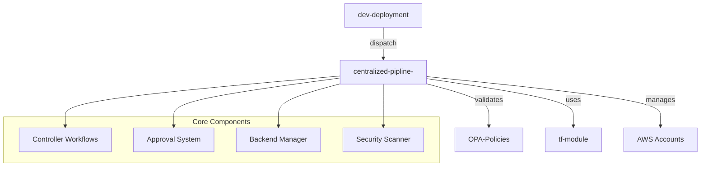
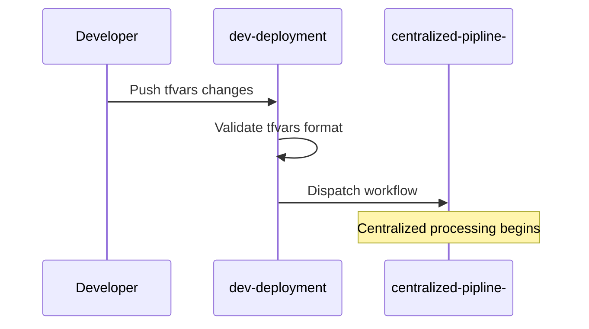
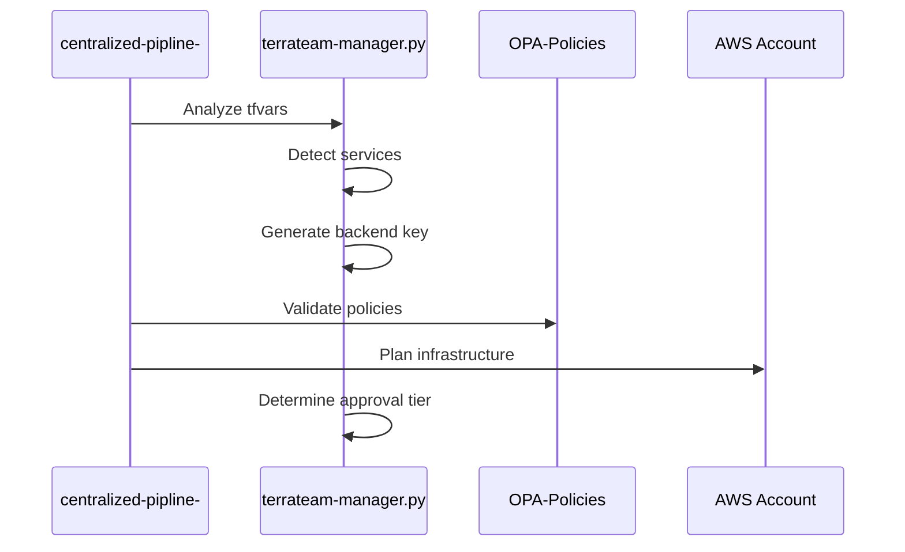
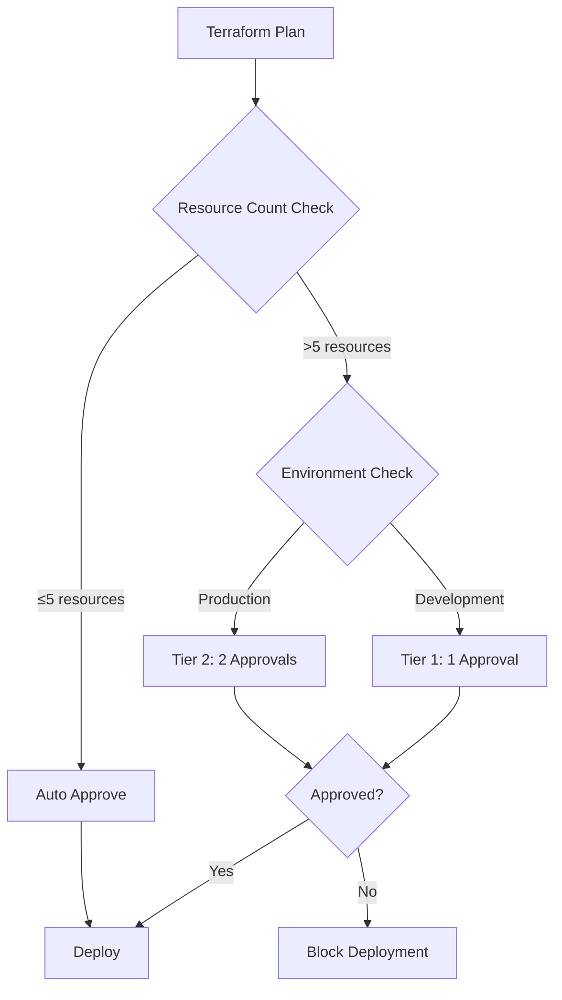

# 🚀 Centralized Terraform Pipeline - Complete Setup Guide

## 📋 Table of Contents
1. [System Overview](#system-overview)
2. [Architecture Components](#architecture-components)
3. [Repository Structure](#repository-structure)
4. [Setup Instructions](#setup-instructions)
5. [How It Works](#how-it-works)
6. [Configuration Guide](#configuration-guide)
7. [Usage Examples](#usage-examples)
8. [Troubleshooting](#troubleshooting)

---

## 🎯 System Overview

This is a **Terrateam-style centralized Terraform pipeline** that provides:

- **🏗️ Multi-repository Terraform management**
- **🔐 Policy-based security validation (OPA)**
- **⚡ Dynamic backend state management**
- **👥 Team-based approval workflows**
- **🎯 Service-aware infrastructure deployment**
- **🔄 Automated CI/CD with GitHub Actions**

### 🌟 Key Features
- **Centralized Control**: Single pipeline manages multiple repositories
- **Dynamic Backends**: Automatic S3 state file organization
- **Service Detection**: Intelligent service identification from tfvars
- **Policy Validation**: OPA security and compliance checks
- **Approval Workflows**: Cost and resource-based approvals
- **Multi-Account Support**: Cross-account deployment capabilities

---

## 🏛️ Architecture Components



### 📦 Repository Breakdown

| Repository | Purpose | Key Files |
|------------|---------|-----------|
| **centralized-pipline-** | 🎛️ **Control Center** | Workflows, approval logic, backend management |
| **dev-deployment** | 🚀 **Trigger Repo** | Project tfvars, dispatch workflows |
| **OPA-Policies** | 🛡️ **Security Policies** | Terraform validation rules |
| **tf-module** | 📦 **Terraform Modules** | Reusable infrastructure components |

---

## 📁 Repository Structure

### 🎛️ centralized-pipline- (Control Center)
```
centralized-pipline-/
├── .github/workflows/
│   ├── centralized-controller.yml     # Main pipeline workflow
│   ├── mcp-enhanced-controller.yml    # MCP-powered workflow
│   └── build-image/                   # Docker build workflow
├── scripts/
│   ├── terrateam-manager.py          # Core logic engine
│   ├── pre-deployment-validator.py   # Pre-deployment checks
│   └── terraform-deployment-orchestrator.py
├── config/
│   ├── accounts.yaml                 # AWS account definitions
│   ├── deployment-rules.yaml         # Approval and policy rules
│   ├── approvers-config.yaml         # Team-based approvers
│   └── checkov-config.yaml           # Security scanning config
├── modules/                          # Terraform modules
├── templates/                        # Template files
└── docs/                            # Documentation
```

### 🚀 dev-deployment (Trigger Repository)
```
dev-deployment/
├── .github/workflows/
│   └── dispatch-to-controller.yml    # Dispatch workflow
├── Accounts/
│   ├── project-1/
│   │   ├── project-1.tfvars         # Project configuration
│   │   └── README.md
│   ├── project-2/
│   │   ├── project-2.tfvars
│   │   └── README.md
│   └── ...
└── docs/
```

### 🛡️ OPA-Policies (Security Repository)
```
OPA-Policies/
├── .github/workflows/               # Policy validation workflows
├── projects/
│   ├── project-specific/           # Project-specific policies
│   └── default/                    # Default security policies
├── terraform/
│   ├── security.rego              # Security validation rules
│   ├── compliance.rego            # Compliance checks
│   └── cost-control.rego          # Cost management policies
└── tests/                         # Policy tests
```

### 📦 tf-module (Module Repository)
```
tf-module/
├── .github/workflows/              # Module validation workflows
├── Module/
│   ├── s3/                        # S3 module
│   ├── vpc/                       # VPC module
│   ├── iam/                       # IAM module
│   ├── kms/                       # KMS module
│   └── ...
└── .terrateam/                    # Terrateam configuration
```

---

## ⚙️ Setup Instructions

### 1. 🔧 Prerequisites

```bash
# Required tools
- GitHub account with repository access
- AWS CLI configured
- Terraform >= 1.0
- Python 3.8+
- Docker (optional)
```

### 2. 🔐 GitHub Secrets Setup

Add these secrets to **centralized-pipline-** repository:

```bash
# AWS Credentials
AWS_ACCESS_KEY_ID=your_access_key
AWS_SECRET_ACCESS_KEY=your_secret_key
AWS_DEFAULT_REGION=us-east-1

# GitHub Token
GITHUB_TOKEN=ghp_your_token_here

# Terraform Cloud (optional)
TF_API_TOKEN=your_tf_cloud_token
```

### 3. 📝 Configuration Files Setup

#### **accounts.yaml**
```yaml
accounts:
  "802860742843":
    id: "802860742843"
    account_name: "arj-wkld-a-prd"
    environment: "production"
    regions: ["us-east-1", "us-west-2"]
    kms_alias_pattern: "alias/terraform-key-{account_short}"
  "123456789012":
    id: "123456789012"
    account_name: "arj-wkld-a-nonprd"
    environment: "development"
    regions: ["us-east-1"]
```

#### **deployment-rules.yaml**
```yaml
# Team definitions
teams:
  platform-team:
    name: "Platform Engineering"
    members: ["user1", "user2"]
    permissions:
      allowed_accounts: ["all"]
      allowed_environments: ["development", "staging", "production"]
      allowed_services: ["all"]

# Approval thresholds
resource_thresholds:
  auto_approve:
    max_resources_created: 5
    max_resources_destroyed: 3
  tier1_approval:
    max_resources_created: 20
    required_approvals: 1
  tier2_approval:
    required_approvals: 2

# Environment settings
environments:
  production:
    auto_approve_enabled: false
    min_required_approvals: 2
  development:
    auto_approve_enabled: true
```

### 4. 🗂️ Project Setup

#### Create a new project in dev-deployment:
```bash
# 1. Create project directory
mkdir -p dev-deployment/Accounts/my-new-project

# 2. Create tfvars file
cat > dev-deployment/Accounts/my-new-project/my-new-project.tfvars << EOF
# Account configuration
accounts = {
  "802860742843" = {
    id           = "802860742843"
    account_id   = "802860742843"
    account_name = "arj-wkld-a-prd"
    environment  = "production"
    regions      = ["us-east-1"]
  }
}

# S3 buckets
s3_buckets = {
  "app-data" = {
    bucket_name = "my-app-data-prd"
    account_key = "802860742843"
    versioning  = true
    encryption  = true
  }
}

# KMS keys
kms_keys = {
  "app-key" = {
    description = "Application encryption key"
    account_key = "802860742843"
    rotation    = true
  }
}
EOF

# 3. Create README
cat > dev-deployment/Accounts/my-new-project/README.md << EOF
# My New Project

## Description
Description of your project infrastructure

## Resources
- S3 bucket for application data
- KMS key for encryption

## Deployment
Push changes to trigger centralized pipeline
EOF
```

---

## 🔄 How It Works

### 1. **Trigger Phase**


### 2. **Processing Phase**


### 3. **Service Detection Logic**
```python
# terrateam-manager.py automatically detects services:
service_map = {
    's3_buckets': 's3',
    'kms_keys': 'kms', 
    'ec2_instances': 'ec2',
    'rds_instances': 'rds',
    'vpc_config': 'vpc'
}

# Backend key generation:
# Single service:  terraform/{account_short}/{project}/{service}/terraform.tfstate
# Multi service:   terraform/{account_short}/{project}/combined/terraform.tfstate
```

### 4. **Approval Workflow**


---

## 🎮 Usage Examples

### Example 1: Simple S3 Deployment
```hcl
# dev-deployment/Accounts/simple-s3/simple-s3.tfvars
accounts = {
  "802860742843" = {
    id = "802860742843"
    account_name = "arj-wkld-a-prd"
    environment = "production"
  }
}

s3_buckets = {
  "website-assets" = {
    bucket_name = "my-website-assets-prd"
    account_key = "802860742843"
  }
}
```

**Result**: 
- Backend key: `terraform/a-prd/simple-s3/s3/terraform.tfstate`
- Approval tier: Auto-approve (1 resource)

### Example 2: Multi-Service Deployment
```hcl
# dev-deployment/Accounts/full-stack/full-stack.tfvars
s3_buckets = { ... }
kms_keys = { ... }
ec2_instances = { ... }
rds_instances = { ... }
```

**Result**:
- Backend key: `terraform/a-prd/full-stack/combined/terraform.tfstate`
- Approval tier: Tier 2 (multiple services, production)

### Example 3: Development Environment
```hcl
accounts = {
  "123456789012" = {
    environment = "development"
  }
}
ec2_instances = { ... }
```

**Result**:
- Backend key: `terraform/a-nonprd/project/ec2/terraform.tfstate`
- Approval tier: Auto-approve (development environment)

---

## 🔧 Configuration Guide

### 1. **Adding New Team Members**
```yaml
# deployment-rules.yaml
teams:
  frontend-team:
    name: "Frontend Team"
    members: ["alice", "bob", "charlie"]
    permissions:
      allowed_accounts: ["123456789012"]
      allowed_environments: ["development", "staging"]
      allowed_services: ["s3", "cloudfront"]
```

### 2. **Custom Approval Rules**
```yaml
# deployment-rules.yaml
resource_thresholds:
  auto_approve:
    max_resources_created: 3
    max_resources_destroyed: 1
  custom_tier:
    max_resources_created: 50
    required_approvals: 3
```

### 3. **Account-Specific Policies**
```yaml
# accounts.yaml
accounts:
  "prod-account":
    security_tier: "high"
    required_policies: ["encryption", "backup", "monitoring"]
  "dev-account":
    security_tier: "standard"
    required_policies: ["basic-security"]
```

---

## 🚨 Troubleshooting

### Common Issues

#### 1. **Workflow Dispatch Fails**
```bash
# Check GitHub token permissions
# Ensure dev-deployment can dispatch to centralized-pipline-

# Fix: Update GitHub token with workflow permissions
```

#### 2. **Backend Key Generation Issues**
```bash
# Check accounts.yaml format
# Verify account ID matches tfvars

# Fix: Update account configuration
```

#### 3. **OPA Policy Failures**
```bash
# Check policy syntax
# Verify terraform plan format

# Fix: Update policies in OPA-Policies repository
```

#### 4. **Approval Workflow Stuck**
```bash
# Check team membership
# Verify approval requirements

# Fix: Update deployment-rules.yaml
```

---

## 🎯 Best Practices

### 1. **Repository Organization**
- Keep project tfvars in separate directories
- Use descriptive project names
- Maintain project README files

### 2. **Security**
- Regularly update OPA policies
- Review approval requirements
- Monitor access logs

### 3. **State Management**
- Use consistent naming conventions
- Regular state file backups
- Monitor state file access

### 4. **Team Management**
- Clear team boundaries
- Regular permission reviews
- Document approval processes

---

## 🔮 Future Enhancements

- **MCP Server Integration**: Real-time cost analysis
- **Drift Detection**: Automated infrastructure drift monitoring
- **Advanced Policies**: Dynamic policy selection
- **Multi-Cloud Support**: Azure and GCP integration

---

## 📞 Support

For issues and questions:
1. Check this documentation
2. Review workflow logs in GitHub Actions
3. Check OPA policy validation results
4. Contact platform engineering team

---

*Last updated: November 2025*