# Enterprise Terraform Pipeline - Executive Overview

## What Is This System?

Automated infrastructure deployment that ensures **100% security compliance** on every deployment.

**Simple Flow:** Push Code → Auto-Validate → Approve → Deploy to AWS

---

## How It Works (3 Simple Steps)

### Step 1: Developer Pushes Code
```
Developer writes infrastructure config → Pushes to GitHub
```

### Step 2: Automatic Security Check
```
System runs:
  ✓ Terraform plan (what will change?)
  ✓ OPA security validation (is it safe?)
  ✓ Posts results to Pull Request
  ✓ Adds labels: opa-passed OR opa-failed
```

### Step 3: Approve and Deploy
```
If OPA passed:
  → Engineer approves PR
  → System auto-merges to environment branch
  → System auto-deploys to AWS
  → Done! Infrastructure updated

If OPA failed:
  → Developer must fix issues
  → Process restarts from Step 2
```

---

## Visual Workflow

```mermaid
flowchart LR
    A[👨‍💻 Push Code] --> B[🔍 Auto Validate]
    B -->|✅ Pass| C[👀 Review]
    B -->|❌ Fail| D[🔧 Fix & Retry]
    C --> E[✅ Approve]
    E --> F[🔀 Auto Merge]
    F --> G[🚀 Auto Deploy]
    G --> H[✅ Live on AWS]
    
    style B fill:#fff3e0
    style C fill:#e3f2fd
    style F fill:#e8f5e9
    style G fill:#ffebee
    style H fill:#c8e6c9
```



---

## Why 4 Repositories?

Each team controls their own area independently:

| Repository | Owner | Purpose |
|------------|-------|---------|
| **dev-deployment** | Dev Teams | Infrastructure configs you want to deploy |
| **centerlized-pipline-** | Platform Team | Controller that runs validation & deployment |
| **OPA-Policies** | Security Team | Security rules (enforced automatically) |
| **tf-module** | Platform Team | Reusable code templates (S3, KMS, IAM) |

**Benefit:** Security can update policies without touching dev code. Platform can improve workflows without dev teams changing anything.

---

## Security System (Label-Based)

**How it prevents unsafe deployments:**

1. **OPA validates during plan** → Results stored in PR labels
2. **Merge blocked** unless `opa-passed` label exists
3. **Deploy blocked** unless `opa-passed` label exists

**Result:** No way to deploy infrastructure that violates security policies

---

## Key Benefits

### Speed
- **Before:** 4-26 hours per deployment
- **After:** 10-15 minutes
- **Savings:** 90% faster

### Quality
- 100% security policy compliance
- Zero manual deployment errors
- Complete audit trail in Git

### Scale
- Unlimited parallel deployments
- Add new team in 30 minutes
- Same process for 10 or 1000 deployments

---

## Real Example

**Deploy an S3 Bucket:**
```bash
# 1. Create file: dev-deployment/S3/my-bucket.tfvars
# 2. git push
# 3. System auto-creates PR
# 4. System validates security (2-3 min)
# 5. You approve PR
# 6. System deploys to AWS (2-3 min)
# 7. Done! Bucket is live
```

**Total time:** 10 minutes  
**Manual work:** Write config + click approve  
**Everything else:** Automated

---

## Technology

- **Terraform** - Infrastructure as Code
- **OPA** - Security policy engine
- **GitHub Actions** - Automation platform
- **Python** - Custom orchestration
- **AWS** - Cloud provider

---

## Version 2.0 Features

**What's New:**
1. ✅ Label-based security (can't bypass OPA)
2. ✅ Environment-aware branching (dev/stage/prod)
3. ✅ Multi-organization support
4. ✅ Complete audit trail
5. ✅ 4-repo architecture (better separation)

**Status:** Production Ready (December 2025)

---

## Quick Reference

**3 Phases:**
1. **VALIDATE** - Controller checks security (automated)
2. **MERGE** - dev-deployment merges after approval (automated)
3. **APPLY** - Controller deploys to AWS (automated)

**Labels Used:**
- `opa-passed` = Safe to merge and deploy
- `opa-failed` = Must fix before merging

**Environments:**
- development → `dev` branch
- staging → `stage` branch  
- production → `prod` branch

---

**Questions?** Contact Platform Team  
**Documentation:** See repository README files
