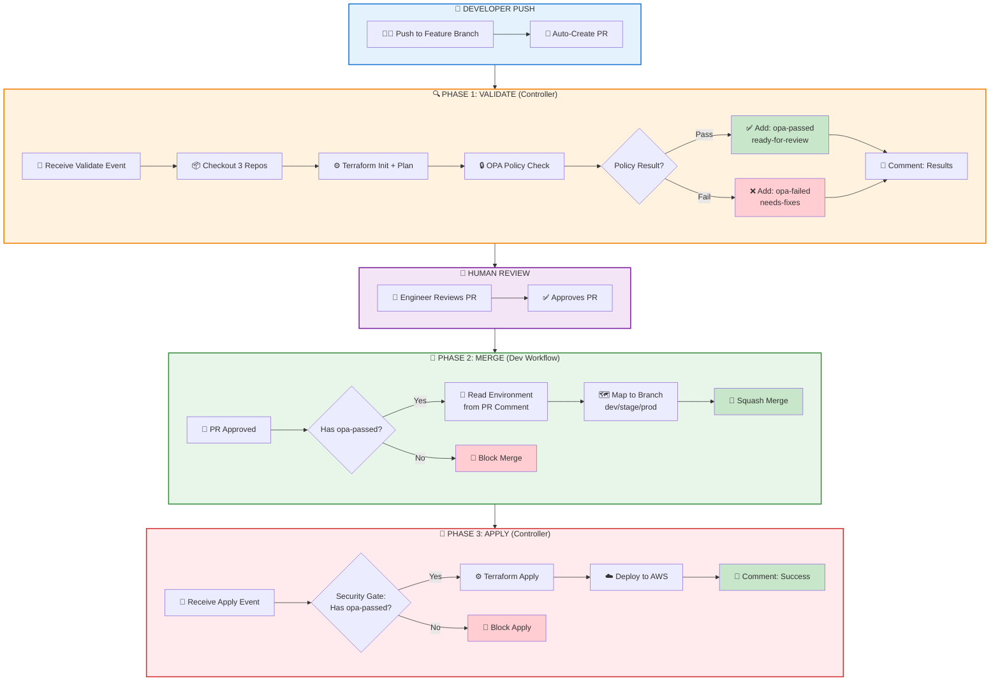
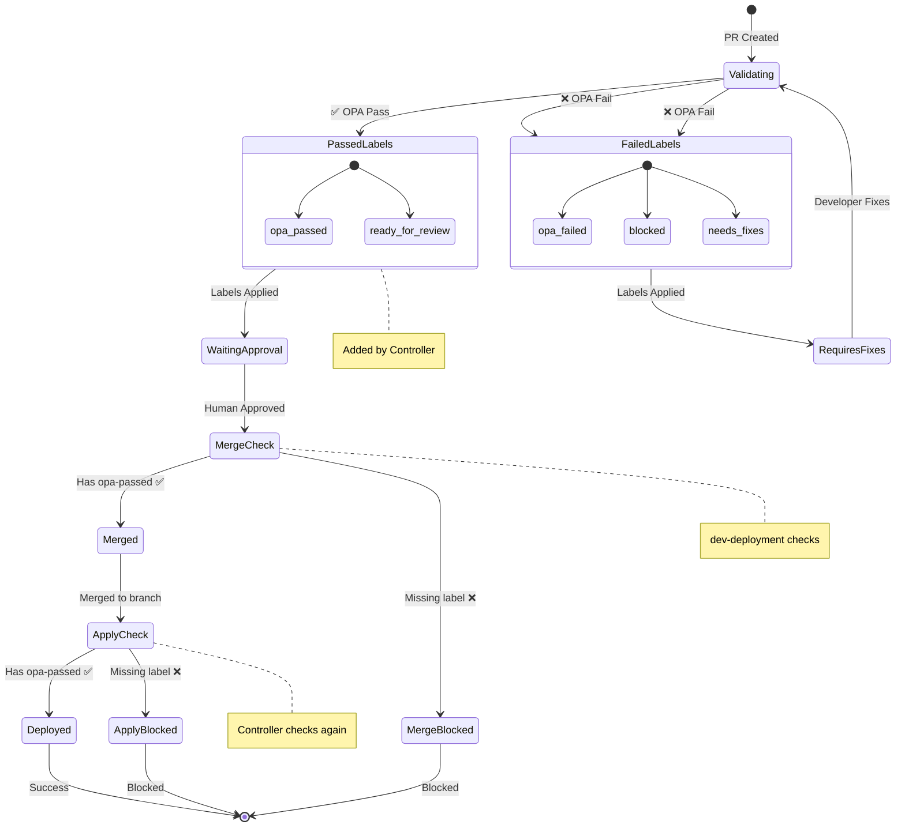
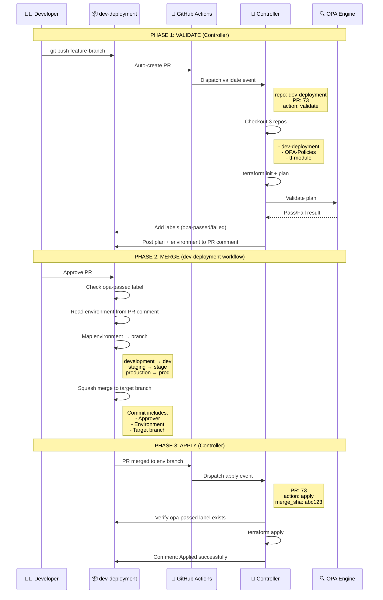
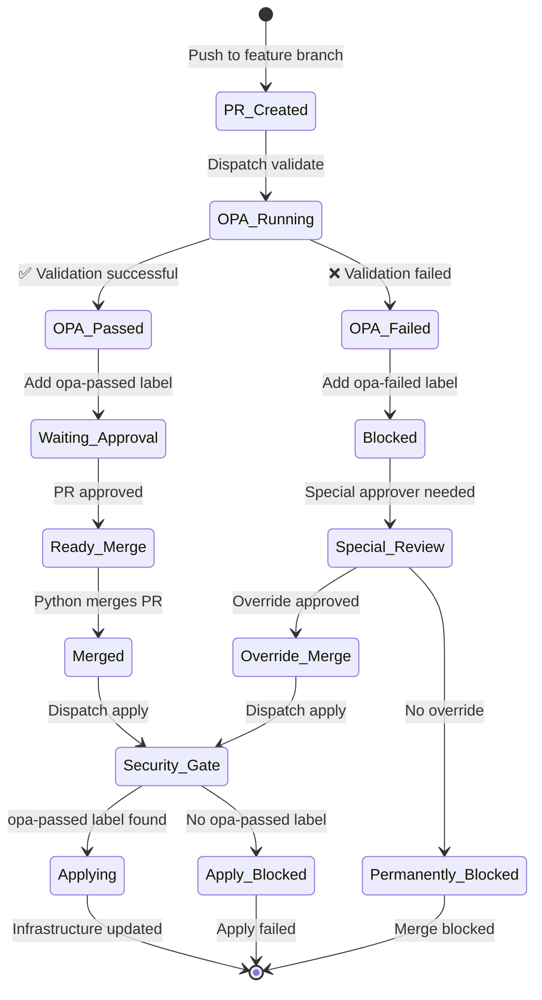
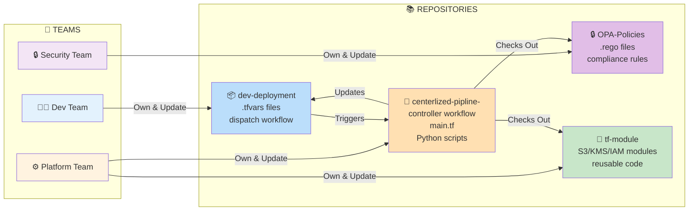
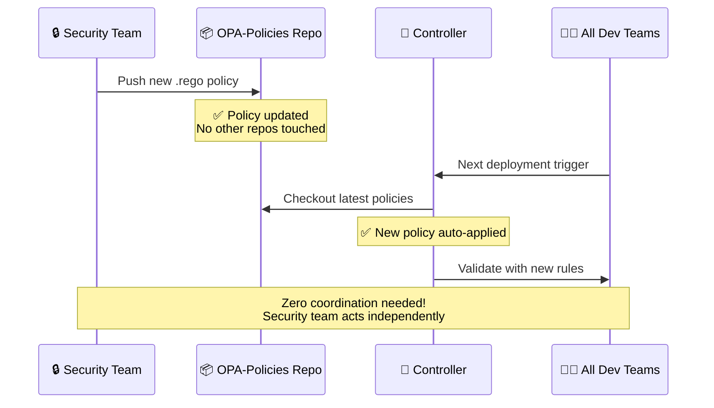

# 🚀 Centralized Terraform Controller - Version 2.0
## Executive Workflow Overview

---

## 📌 What Is This System?

**Enterprise-Grade Automated Infrastructure Deployment Platform**

Push configuration → Auto-validate → Security check → Deploy to AWS

### Simple Explanation
Developers push infrastructure configurations (`.tfvars` files) to GitHub. The system automatically validates, checks security policies, and deploys to AWS Cloud—**no manual intervention required**.

---

## 🏗️ System Architecture

### 4-Repository Model

**Separation of Concerns:**
1. **dev-deployment** - Infrastructure configurations (`.tfvars` files)
2. **centerlized-pipline-** - Centralized controller (executes all workflows)
3. **OPA-Policies** - Security and compliance rules (`.rego` files)
4. **tf-module** - Reusable infrastructure code (Terraform modules)

---

## 🔄 Complete Workflow - Version 2.0




---

## 📊 Three-Phase Breakdown

### Phase 1: VALIDATE (Automated)
**Location:** Controller Repository  
**Trigger:** PR created or updated

1. ✅ Developer pushes `.tfvars` to feature branch
2. ✅ Auto-creates Pull Request
3. ✅ Dispatches validate event to controller
4. ✅ Controller checks out 3 repos (dev-deployment, OPA-Policies, tf-module)
5. ✅ Runs Terraform plan
6. ✅ OPA validates against security policies
7. ✅ **Adds labels:**
   - Success: `opa-passed` + `ready-for-review`
   - Failure: `opa-failed` + `needs-fixes`
8. ✅ Posts detailed results to PR comment

**Output:** Plan results + OPA validation status + Labels

---

### Phase 2: MERGE (Manual Approval Required)
**Location:** dev-deployment Repository  
**Trigger:** PR approved by reviewer

1. ✅ Engineer reviews PR and validation results
2. ✅ Approves PR (GitHub approval button)
3. ✅ **Merge workflow checks:**
   - Must have `opa-passed` label
   - Must have approval
4. ✅ Reads environment from controller's PR comment
5. ✅ Maps to environment branch:
   - `development` → `dev`
   - `staging` → `stage`
   - `production` → `prod`
6. ✅ Squash merges with audit information
7. ❌ **Blocks merge** if `opa-passed` label missing

**Output:** Merged PR to environment branch

**Important:** Merge is handled by **dev-deployment workflow**, NOT the controller!

---

### Phase 3: APPLY (Automated Deployment)
**Location:** Controller Repository  
**Trigger:** PR merged to environment branch

1. ✅ dev-deployment dispatches apply event
2. ✅ **Security Gate:** Controller validates `opa-passed` label
3. ✅ Discovers deployments from merged files
4. ✅ Runs Terraform apply
5. ✅ Deploys to AWS Cloud
6. ✅ Posts deployment results to PR
7. ✅ Cleans up feature branch
8. ❌ **Blocks deployment** if label missing or removed

**Output:** Infrastructure deployed + Results comment

---

## 🔒 Three-Layer Security System

| Security Gate | Phase | Enforced By | Action if Failed |
|---------------|-------|-------------|------------------|
| **Gate 1: OPA Validation** | Phase 1 (Validate) | Controller | Adds `opa-failed` label, blocks merge |
| **Gate 2: Merge Check** | Phase 2 (Merge) | dev-deployment workflow | Blocks merge, posts error |
| **Gate 3: Apply Check** | Phase 3 (Apply) | Controller | Blocks deployment, closes PR |

**Result:** No deployment without OPA approval - enforced at 3 different checkpoints.

---

## 🏷️ Label-Based Security Flow



### Label Reference

| Label | Meaning | When Added |
|-------|---------|------------|
| ✅ `opa-passed` | Security approved | OPA validation succeeds |
| ✅ `ready-for-review` | Safe to review | Plan completes successfully |
| ❌ `opa-failed` | Security blocked | Policy violations found |
| ❌ `needs-fixes` | Changes required | Developer must fix issues |

**Security:** Labels prevent deployment without OPA approval - checked at merge AND apply.

---

## 💼 Real-World Example

**Scenario:** Developer adds S3 bucket for new project

### Step 1: Developer Pushes Configuration
```bash
# Create configuration file
cat > Accounts/my-project/my-project.tfvars <<EOF
account_name = "my-project"
environment = "development"
owner = "john.doe@company.com"

s3_buckets = [{
  name = "my-app-data-bucket"
  versioning = true
  encryption = "AES256"
}]
EOF

# Push to GitHub
git add Accounts/my-project/
git commit -m "Add S3 bucket for my-project"
git push origin feature/add-s3-bucket
```

### Step 2: Automatic Validation (2-3 minutes)
- ✅ PR auto-created
- ✅ Terraform plan runs
- ✅ OPA validates policies
- ✅ `opa-passed` label added
- ✅ Results posted to PR

### Step 3: Human Review (varies)
- Engineer reviews PR comment
- Checks validation results
- Approves PR

### Step 4: Automatic Merge & Deploy (3-5 minutes)
- ✅ Checks `opa-passed` label
- ✅ Merges to `dev` branch
- ✅ Terraform apply runs
- ✅ S3 bucket created in AWS
- ✅ Results posted to PR

**Total Time:** ~10 minutes from push to production (mostly automated)

---

## Data Flow Details



---

## Label-Based Flow



---

## Why 4 Repositories?

### Repository Interaction Map



### Ownership & Responsibility

| Repo | Owner | Contains | Why Separate? | Update Frequency |
|------|-------|----------|---------------|------------------|
| dev-deployment | Dev Teams | .tfvars configs | Teams control their own infrastructure | Daily |
| centerlized-pipline- | Platform Team | Workflows, main.tf | Update logic once, affects all teams | Weekly |
| OPA-Policies | Security Team | .rego security rules | Security team controls policies independently | Monthly |
| tf-module | Platform Team | Reusable modules | Shared code, versioned separately | Monthly |

**Key Benefit:** Each team updates their repo without affecting others

### Real-World Example

**Scenario:** Security team needs to add new compliance rule



---

## Key Components

**Controller Workflows (centerlized-pipline-):**
- `.github/workflows/centralized-controller.yml` - Handles **validate** and **apply** only
  - Listens for: `terraform_pr` (validate), `terraform_apply` (apply)
  - Does NOT handle merge

**Dev Workflows (dev-deployment):**
- `.github/workflows/dispatch-to-controller.yml` - Handles full PR lifecycle
  - Job 1: Auto-create PR on push
  - Job 2: Dispatch validate to controller
  - Job 3: **Merge PR** (reads OPA labels, merges to env branch)
  - Job 4: Dispatch apply to controller

**Python Scripts (controller):**
- `opa-validator.py` - Security validation
- `terraform-deployment-orchestrator-enhanced.py` - Deployment execution
- ~~`handle_pr_merge.py`~~ - NOT USED (merge handled by dev workflow)

**Configuration:**
- `accounts.yaml` - AWS account mappings
- `deployment-rules.yaml` - Deployment policies

---

## Security Layers

**4-Level Protection:**
1. **OPA Validation (Controller)** - Automated policy checks during validate phase
2. **Label System** - Controller adds labels, dev workflow reads them
3. **Human Approval** - Required before dev workflow merges
4. **Security Gate (Controller)** - Apply blocked without `opa-passed` label

**Merge Responsibility:**
- **Controller**: Does NOT merge PRs
- **dev-deployment workflow**: Handles merge after checking OPA labels

**Complete Audit:**
- Git history (commit messages with approval info)
- PR comments (validation results from controller)
- Workflow logs (execution details in both repos)
- Labels (OPA status visible, set by controller)

---

## 🔧 Technical Stack

### Technology & Tools

| Component | Technology | Version | Purpose |
|-----------|-----------|---------|----------|
| **IaC** | Terraform | 1.11.0 | Infrastructure as Code |
| **Security** | OPA | 0.59.0 | Policy validation |
| **Orchestration** | GitHub Actions | Latest | Workflow automation |
| **Scripting** | Python | 3.x | Custom orchestration |
| **State** | AWS S3 + DynamoDB | - | State storage & locking |
| **Source Control** | Git | - | Version control |

---

## 🎯 Key Benefits - Version 2.0

### For Developers
- ✅ Push `.tfvars` → Everything automated
- ✅ Fast feedback (validation in 2-3 minutes)
- ✅ Clear error messages from OPA
- ✅ No pipeline knowledge needed

### For Platform Teams
- ✅ Update controller once → Affects all teams
- ✅ Centralized policy enforcement
- ✅ Complete deployment visibility
- ✅ Easy to maintain and scale

### For Security Teams
- ✅ OPA policies enforced automatically
- ✅ Three security gates (validate, merge, apply)
- ✅ Complete audit trail
- ✅ No bypassing security checks

### For Management
- ✅ **Faster Time-to-Market:** Deploy infrastructure in ~10 minutes vs hours/days
- ✅ **Developer Productivity:** 3x faster deployment cycle, developers focus on code not pipelines
- ✅ **Business Impact:** Accelerate application delivery, faster feature releases
- ✅ **Risk Reduction:** 100% policy compliance, zero manual errors, complete audit trail
- ✅ **Cost Efficiency:** Automated workflows save ~140 hours/month of engineering time
- ✅ **Scalability:** Handle 1000s of deployments with same team size

---

## 👥 Multi-Team Support

### How It Works for Multiple Teams

**Each Team:**
- Own `dev-deployment` repository (team-specific)
- Own AWS accounts (dev/staging/prod)
- Independent deployment schedules
- Full autonomy over their infrastructure

**Shared Centralized Platform:**
- Same controller workflow for all teams
- Same security policies enforced
- Same Terraform modules available
- Consistent deployment process

**Benefits:**
- Teams work independently without conflicts
- Platform team manages one controller for all teams
- Security team controls policies centrally
- Add new teams without code changes

**Onboarding Time:** ~30 minutes per new team

---

## 🚀 Quick Start

### Example: Deploy S3 Bucket

```bash
# Step 1: Create configuration
cat > Accounts/my-project/my-project.tfvars <<EOF
account_name = "my-project"
environment = "development"
owner = "john.doe@company.com"

s3_buckets = [{
  name = "my-app-data-bucket"
  versioning = true
  encryption = "AES256"
}]
EOF

# Step 2: Push to GitHub
git add Accounts/my-project/
git commit -m "Add S3 bucket for my-project"
git push origin feature/add-s3-bucket

# Step 3: Automated workflow
# ✅ PR auto-created
# ✅ Terraform plan runs
# ✅ OPA validates
# ✅ Results posted to PR
# ✅ Labels added (opa-passed/opa-failed)

# Step 4: Human review
# Engineer reviews and approves PR

# Step 5: Automatic deployment
# ✅ PR merges to environment branch
# ✅ Terraform apply runs
# ✅ S3 bucket created in AWS
# ✅ Results posted to PR

# Total time: ~10 minutes (mostly automated)
```

---

## 📋 Summary

### What This System Does

**Automated Infrastructure Deployment:**
- Push configuration → Auto-validate → Security check → Deploy to AWS
- **3 Phases:** Validate (controller) → Merge (dev workflow) → Apply (controller)
- **3 Security Gates:** OPA validation, merge check, apply check
- **Complete audit trail:** Git history + PR comments + workflow logs

### Key Architecture Points

**4-Repository Model:**
1. **dev-deployment** - Configuration storage + PR lifecycle management
2. **centerlized-pipline-** - Centralized controller (validate + apply only)
3. **OPA-Policies** - Security and compliance rules
4. **tf-module** - Reusable infrastructure modules

**Workflow Distribution:**
- **Controller:** Terraform validate, OPA check, Terraform apply
- **dev-deployment:** Auto-create PR, dispatch validate, **merge PR**, dispatch apply
- **Merge is NOT handled by controller** - Confirmed in actual code

**Label-Based Security:**
- OPA runs once during validate phase
- Results cached in labels (`opa-passed` or `opa-failed`)
- Merge workflow checks labels before merging
- Apply workflow checks labels before deploying
- Three security gates enforce compliance

### Production-Ready Features

- ✅ Fully automated PR-to-deployment workflow
- ✅ Environment-based branching (dev/stage/prod)
- ✅ Multi-deployment support (multiple .tfvars in one PR)
- ✅ Complete audit trail (who, what, when, why)
- ✅ Zero manual errors (label-based gates)
- ✅ 100% policy compliance (OPA enforced)
- ✅ Multi-organization support
- ✅ Scalable to 1000s of deployments

---

## 📚 Documentation

**Related Documents:**
- `WORKFLOW-VERSION-2.0.md` - Complete technical documentation
- `EXECUTIVE-WORKFLOW-OVERVIEW-SIMPLE.md` - Simplified overview
- `centerlized-pipline-/README.md` - Controller repository guide
- `OPA-Policies/README.md` - Security policy documentation

---

## 📅 Release Information

- **Version:** 2.0
- **Release Date:** December 2024
- **Architecture:** 4-Repository Model
- **License:** Internal Use Only

---

**🎯 Bottom Line:** Version 2.0 is an enterprise-grade, fully automated infrastructure deployment platform with three-layer security gates, complete audit trails, and support for multiple organizations. Push code → Deploy to AWS in ~10 minutes.
