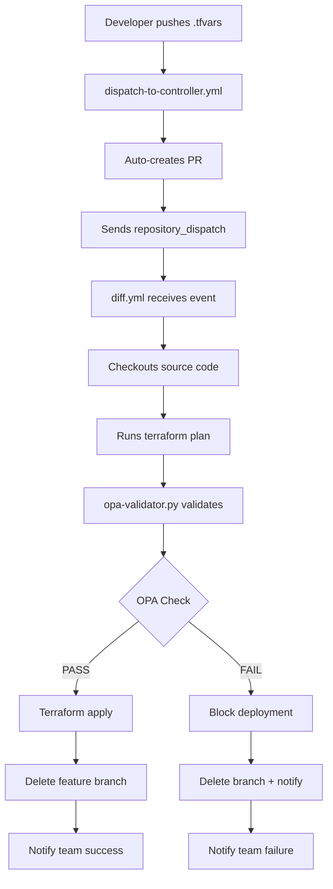

  still l# 🎯 THE MAIN SCRIPT & MISSION

## 🚀 THE MISSION
**Centralized Terraform deployment with automatic security validation and branch management**

### Core Purpose
1. **🛡️ SECURITY FIRST**: Every infrastructure change must pass OPA policy validation
2. **🔄 ZERO FRICTION**: Developers just push .tfvars, everything else is automated
3. **🧹 CLEAN REPOS**: Automatic branch cleanup prevents repository clutter
4. **📢 TEAM AWARENESS**: Everyone knows what's happening via @mentions

---

## 🎯 MAIN SCRIPTS

### 1. Primary Controller: `diff.yml`
**Location**: `centerlized-pipline-/.github/workflows/diff.yml`
**Mission**: Complete Terraform lifecycle management

```yaml
# THE BRAIN OF THE OPERATION
name: Centralized Controller
on:
  repository_dispatch:
    types: [terraform_pr, terraform_apply]

# WHAT IT DOES:
# 1. Receives dispatch from dev repos
# 2. Runs Terraform plan/apply
# 3. Validates with OPA policies
# 4. Deploys to AWS
# 5. Cleans up branches
# 6. Notifies team
```

### 2. OPA Validator: `opa-validator.py`  
**Location**: `centerlized-pipline-/scripts/opa-validator.py`
**Mission**: Security policy enforcement

```python
#!/usr/bin/env python3
"""
THE SECURITY GATEKEEPER

Mission: Ensure every infrastructure resource has proper tags
- Checks for ManagedBy tags (critical for tracking)
- Validates compliance policies
- Generates detailed reports
- Blocks deployment if violations found
"""

# KEY FUNCTION: Validates missing ManagedBy tags
def validate_terraform_plan():
    # Scans Terraform plan JSON
    # Checks every resource for required tags
    # Returns violation report
```

### 3. Event Trigger: `dispatch-to-controller.yml`
**Location**: `dev-deployment/.github/workflows/dispatch-to-controller.yml`  
**Mission**: Smart workflow triggering

```yaml
# THE MESSENGER
name: Dev Repository Workflow
on:
  push:
    paths: ['Accounts/**/*.tfvars']  # Only .tfvars changes trigger

# WHAT IT DOES:
# 1. Detects .tfvars changes
# 2. Auto-creates PR if needed  
# 3. Sends repository_dispatch to controller
# 4. Hands off to main pipeline
```

---

## 🔄 THE COMPLETE MISSION FLOW



---

## 🛡️ THE SECURITY MISSION

### What OPA Validator Checks
```python
# CRITICAL VALIDATION RULES
required_tags = {
    "ManagedBy": "Terraform",     # WHO manages this resource
    "Environment": "prod/dev",    # WHICH environment  
    "Project": "project-name"     # WHICH project owns it
}

# MISSION: Zero untracked infrastructure
# RESULT: Every resource is accountable
```

### Why This Matters
- **📊 COST TRACKING**: Know which project owns what
- **🔍 SECURITY AUDITS**: Find all resources managed by Terraform  
- **🧹 CLEANUP**: Identify orphaned resources
- **📋 COMPLIANCE**: Meet enterprise governance requirements

---

## 🎯 KEY MISSION COMPONENTS

### 1. **Centralized Control**
```
One repo (centerlized-pipline-) controls ALL infrastructure
- All Terraform configs in one place
- Single pipeline for all deployments  
- Consistent policies across all projects
```

### 2. **Security-First Design**
```
Every deployment MUST pass OPA validation
- No exceptions for missing tags
- Detailed violation reporting
- Automatic blocking of non-compliant changes
```

### 3. **Zero-Friction Experience** 
```
Developers only need to:
1. Create .tfvars file
2. Push to branch
3. Everything else is automatic
```

### 4. **Automatic Maintenance**
```
Repository stays clean:
- Feature branches auto-deleted after apply
- Protected branches (main/master) preserved
- Failed branches cleaned up with clear guidance
```

### 5. **Team Collaboration**
```
Everyone stays informed:
- @mentions for all stakeholders
- Detailed PR comments with results
- Clear next-step guidance on failures
```

---

## 🔧 CURRENT ACTIVE CONFIGURATION

### Main Repositories
```
centerlized-pipline-  → Main controller (THE BRAIN)
dev-deployment       → Project trigger (THE MESSENGER)  
OPA-Policies         → Security rules (THE GUARDIAN)
```

### Key Scripts in Action
```
diff.yml                    → Main workflow (1275 lines of automation)
opa-validator.py           → Security validator (519 lines of validation)  
dispatch-to-controller.yml → Event trigger (198 lines of smart routing)
```

### AWS Accounts Managed
```
802860742843 → arj-wkld-a-prd (Production)
982534358538 → arj-wkld-a-nonprd (Development)  
```

---

## 🎯 THE BOTTOM LINE

**MISSION**: Make infrastructure deployment **secure**, **automatic**, and **maintainable**

**RESULT**: Developers focus on infrastructure requirements, pipeline handles security, deployment, and cleanup automatically.

**SUCCESS CRITERIA**: 
- ✅ Zero untagged resources in production
- ✅ Zero manual deployment steps  
- ✅ Zero repository clutter from stale branches
- ✅ 100% team awareness of infrastructure changes

*This is enterprise-grade Infrastructure as Code with built-in security and automation.*