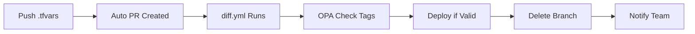

# 🚀 Simple Terraform Pipeline Guide

## What This Does
**Push .tfvars → Auto PR → Validation → Deploy → Cleanup**

---

## 📁 Repository Structure

### centerlized-pipline- (Main Controller)
```
centerlized-pipline-/
├── .github/workflows/
│   └── diff.yml                    # 🎯 MAIN WORKFLOW
├── scripts/
│   └── opa-validator.py           # 🔍 Validates missing tags
├── main.tf                        # Terraform config
├── accounts.yaml                  # AWS accounts
└── deployment-rules.yaml          # Team settings
```

### dev-deployment (Trigger Repo)
```
dev-deployment/
├── .github/workflows/
│   └── dispatch-to-controller.yml # 📡 Sends events to controller
└── Accounts/
    ├── test-4-poc-1/
    │   └── test-4-poc-1.tfvars   # Your project config
    └── test-poc-3/
        └── test-poc-3.tfvars
```

---

## ⚙️ Quick Setup

### 1. GitHub Secrets (Both Repos)
```
GT_APP_ID=your_github_app_id
GT_APP_PRIVATE_KEY=your_private_key
AWS_ACCESS_KEY_ID=your_aws_key
AWS_SECRET_ACCESS_KEY=your_aws_secret
```

### 2. Create Project
```bash
# 1. Create directory
mkdir dev-deployment/Accounts/my-project

# 2. Create tfvars
cat > dev-deployment/Accounts/my-project/my-project.tfvars << EOF
accounts = {
  "802860742843" = {
    account_name = "arj-wkld-a-prd"
    environment = "production"
  }
}

s3_buckets = {
  "my-bucket" = {
    bucket_name = "my-app-bucket"
    account_key = "802860742843"
    tags = {
      ManagedBy = "Terraform"    # ⚠️ REQUIRED - OPA checks this
      Environment = "production"
      Project = "my-project"
    }
  }
}
EOF
```

---

## 🔄 How It Works



### Step by Step
1. **Push** .tfvars to feature branch
2. **dispatch-to-controller.yml** auto-creates PR
3. **diff.yml** receives repository_dispatch event
4. **opa-validator.py** checks for ManagedBy tags
5. If valid: **Terraform apply** runs
6. **Feature branch deleted** automatically
7. **Team @mentioned** in notifications

---

## 📝 Examples

### ✅ GOOD Example (Will Deploy)
```hcl
s3_buckets = {
  "app-data" = {
    bucket_name = "my-app-data"
    tags = {
      ManagedBy = "Terraform"     # ✅ Required
      Environment = "production"
      Project = "my-app"
    }
  }
}
```

### ❌ BAD Example (Will Fail)
```hcl
s3_buckets = {
  "bad-bucket" = {
    bucket_name = "bad-bucket"
    tags = {
      Environment = "production"
      # ❌ Missing ManagedBy tag!
    }
  }
}
```

---

## 🚨 Common Issues

### OPA Validation Fails
```
Error: Missing 'ManagedBy' tag
Fix: Add tags = { ManagedBy = "Terraform" }
```

### Workflow Not Triggering
```
Check: File must be in Accounts/**/*.tfvars path
Check: GitHub App secrets (GT_APP_ID, GT_APP_PRIVATE_KEY)
```

### Branch Cleanup Fails
```
Note: Protected branches (main/master) are never deleted
Note: Cleanup failure doesn't stop workflow
```

---

## 🎯 Key Files

| File | Purpose |
|------|---------|
| **diff.yml** | Main controller workflow |
| **dispatch-to-controller.yml** | Triggers from dev-deployment |
| **opa-validator.py** | Checks for missing tags |
| **accounts.yaml** | AWS account definitions |
| **main.tf** | Terraform configuration |

---

## 📞 Quick Help

1. **Validation failing?** → Add `ManagedBy = "Terraform"` tag
2. **Workflow not starting?** → Check file path: `Accounts/project/project.tfvars`
3. **No PR created?** → Check GitHub App permissions
4. **Branch not deleted?** → Normal for main/master (protected)

---

*Simple guide - focuses only on what actually works*