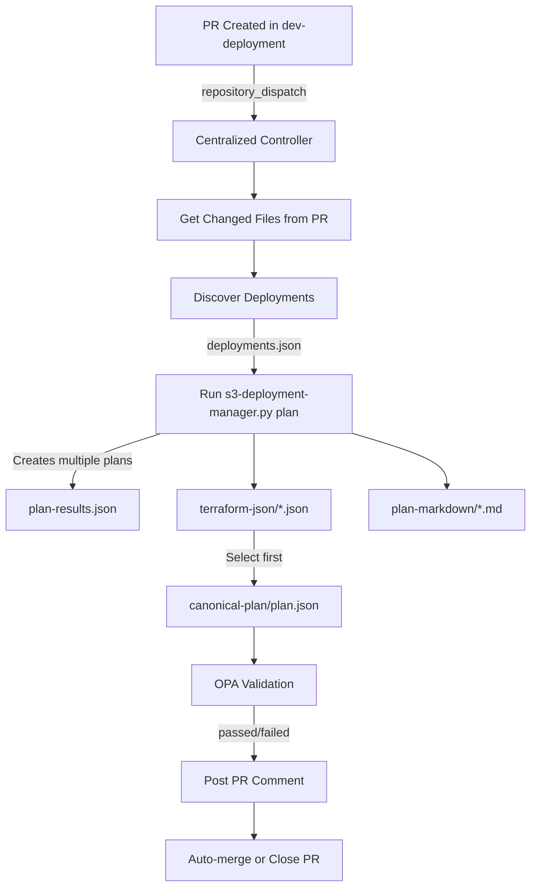

# ✅ Centralized Controller Workflow - FIXED

## 🎯 Problem Identified
The centralized-controller.yml was using **inconsistent approach**:
- ❌ Step 1: Used `s3-deployment-manager.py discover` (correct)
- ❌ Step 2: Used direct `terraform plan -var-file=...` (WRONG - only handles ONE file)
- ❌ Step 3: OPA validation on single plan

**Issue**: Could NOT handle multiple deployments from different accounts!

## ✅ Solution Applied
Aligned with proven pattern from `s3-deployment-old.yml` and `S3_Mgmt`:

### Before (Lines 149-173):
```yaml
- name: 📋 Terraform Plan
  working-directory: controller
  run: |
    cp -r ../source-repo/Accounts ./
    terraform init
    
    terraform plan \
      -var-file="../source-repo/$(echo '...' | awk '{print $1}')" \
      -out=tfplan
    
    terraform show -json tfplan > ../source-repo/terraform-plan.json
```

### After (Lines 148-206):
```yaml
- name: 📋 Terraform Plan
  working-directory: source-repo
  run: |
    # Use deployment manager to handle MULTIPLE deployments
    python3 ../controller/scripts/s3-deployment-manager.py plan \
      --deployments-json deployments.json \
      --output-summary plan-results.json \
      --debug
    
    # Extract counts
    total=$(jq -r '.total_deployments // 0' plan-results.json)
    successful=$(jq -r '.successful_plans // 0' plan-results.json)
    failed=$(jq -r '.failed_plans // 0' plan-results.json)
    
    # Select canonical plan for OPA
    mkdir -p canonical-plan
    FIRST_JSON=$(ls terraform-json/*.json 2>/dev/null | head -n1)
    cp "$FIRST_JSON" canonical-plan/plan.json
```

## 🔄 Key Changes

### 1. **Terraform Plan** (Step 2)
- ✅ Now uses `s3-deployment-manager.py plan` instead of direct terraform
- ✅ Handles multiple deployments from different accounts
- ✅ Creates structured outputs:
  - `plan-results.json` - Summary with counts
  - `terraform-json/*.json` - Plan files for OPA
  - `plan-markdown/*.md` - Human-readable plans
  - `canonical-plan/plan.json` - Selected plan for OPA
  - `plans/*.tfplan` - Binary plan files

### 2. **OPA Validation** (Step 3)
- ✅ Updated to use `canonical-plan/plan.json`
- ✅ Only runs if `opa_plan_ready == 'true'`
- ✅ Shows violations in PR comment

### 3. **PR Comment** (Step 4)
- ✅ Shows comprehensive plan summary table
- ✅ Lists all deployments with status
- ✅ Includes plan markdown from artifacts
- ✅ Shows OPA validation results

### 4. **Artifacts** (Step 5)
- ✅ Uploads all plan outputs:
  - `deployments.json`
  - `plan-results.json`
  - `terraform-json/`
  - `plan-markdown/`
  - `canonical-plan/`
  - `plans/`
  - `logs/`
  - `opa-result.txt`

## 📊 Workflow Flow (Fixed)



## ✅ Benefits

1. **Multi-Account Support**: Can process deployments from different accounts in ONE workflow run
2. **Proper Error Handling**: Continues even if some plans fail, shows all results
3. **Rich Feedback**: PR comments show detailed plan summary for ALL deployments
4. **Consistent Pattern**: Same approach as proven S3_Mgmt and s3-deployment-old.yml
5. **Scalable**: Can handle 1 or 100 deployments with same workflow

## 🧪 Testing Plan

1. Create PR in dev-deployment with multiple tfvars files from different accounts
2. Verify workflow discovers all deployments
3. Verify plan runs for each deployment
4. Verify plan-results.json contains all deployments
5. Verify OPA validation runs on canonical plan
6. Verify PR comment shows all plan results
7. Verify artifacts contain all outputs

## 📝 Next Steps

1. ✅ **Fixed**: Workflow now uses proper multi-deployment pattern
2. ⏳ **Test**: Create test PR with multiple account changes
3. ⏳ **Verify**: Check all artifacts are created
4. ⏳ **Optional**: Add external OPA dispatch (like S3_Mgmt) for more advanced validation
