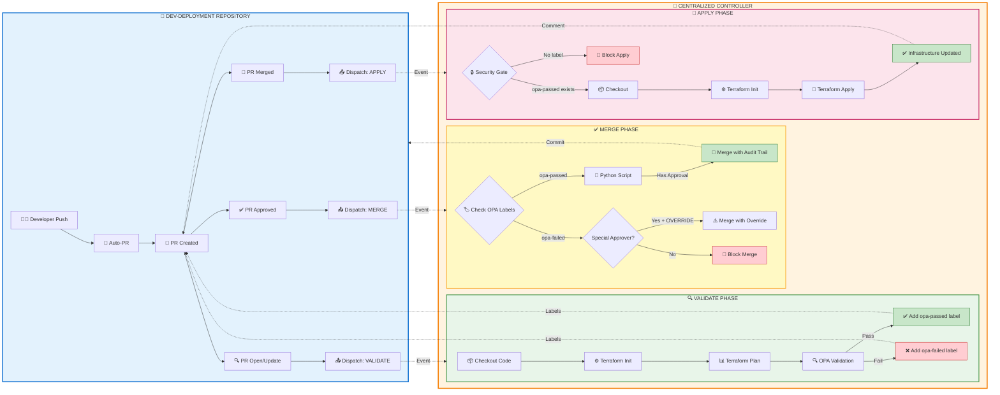
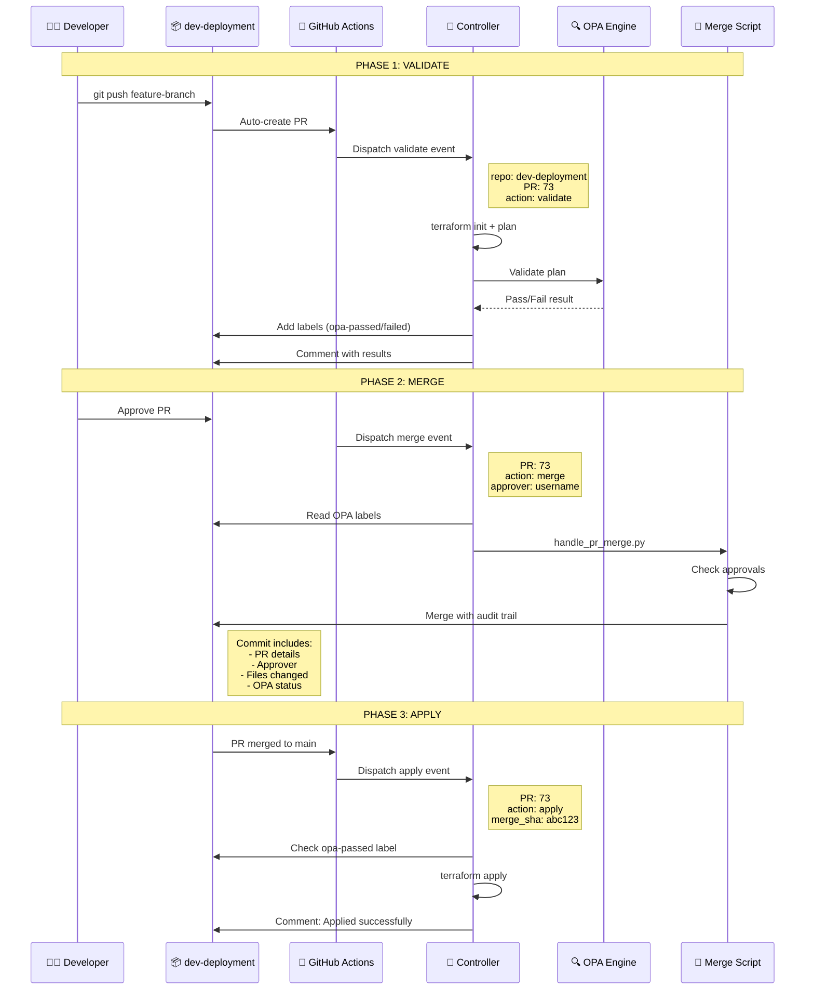
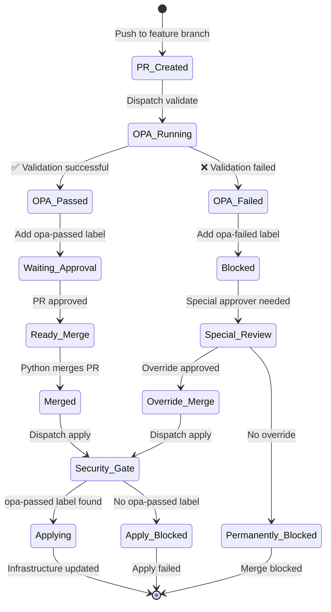
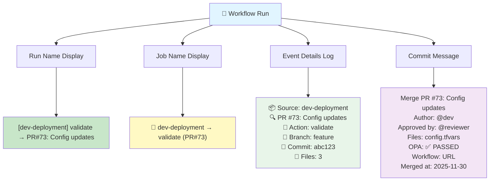
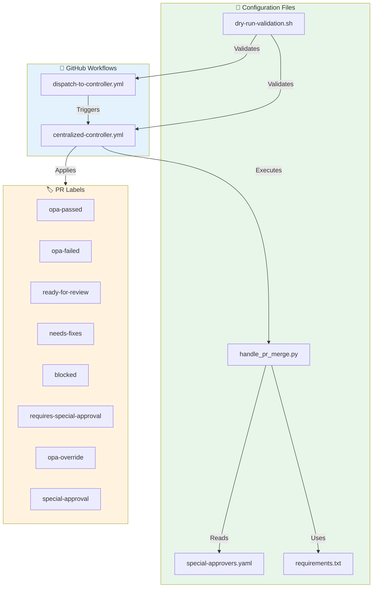

# 🚀 Centralized Terraform Pipeline V2 - Visual Diagram

## 📊 Workflow Architecture



---

## 🔄 Data Flow Details



---

## 🏷️ Label-Based Flow



---

## 📋 Enhanced Logging Output



---

## ⚙️ Component Architecture



---

## 🎯 Key Features Summary

| Feature | Description | Benefit |
|---------|-------------|---------|
| 🔍 **OPA Labels** | Cached validation results | No re-runs, faster merges |
| 🐍 **Python Handler** | Smart merge logic | Custom approval rules |
| 📝 **Dynamic Commits** | Full audit trail in git | Complete traceability |
| 🔒 **Security Gates** | Label-based checks | Prevent unauthorized changes |
| 📊 **Enhanced Logging** | Detailed context display | Easy debugging |
| ⚠️ **Special Override** | Senior approver bypass | Emergency flexibility |
| 📋 **10 Properties** | Optimized payload | GitHub API compliant |
| ✅ **Dry-Run Validation** | Pre-deployment checks | Catch errors early |

---

## 📈 Audit Trail Example

**GitHub Actions View:**
```
🎯 Centralized Terraform Controller
  ├─ 🚀 dev-deployment → validate (PR#73)   ✅ 2m 34s
  ├─ 🚀 dev-deployment → merge (PR#73)      ✅ 45s  
  └─ 🚀 dev-deployment → apply (PR#73)      ✅ 3m 12s
```

**Git Commit History:**
```
456abc Merge PR #73: Update S3 bucket configuration
       Author: @developer
       Approved by: @senior-engineer
       Files changed (2):
         - Accounts/prod/s3.tfvars
         - Accounts/prod/policy.json
       OPA Validation: ✅ PASSED
       Workflow: https://github.com/.../actions/runs/123
       Merged at: 2025-11-30T10:45:23Z
```

---

**Version**: 2.0  
**Status**: ✅ Production Ready  
**Last Updated**: November 30, 2025
