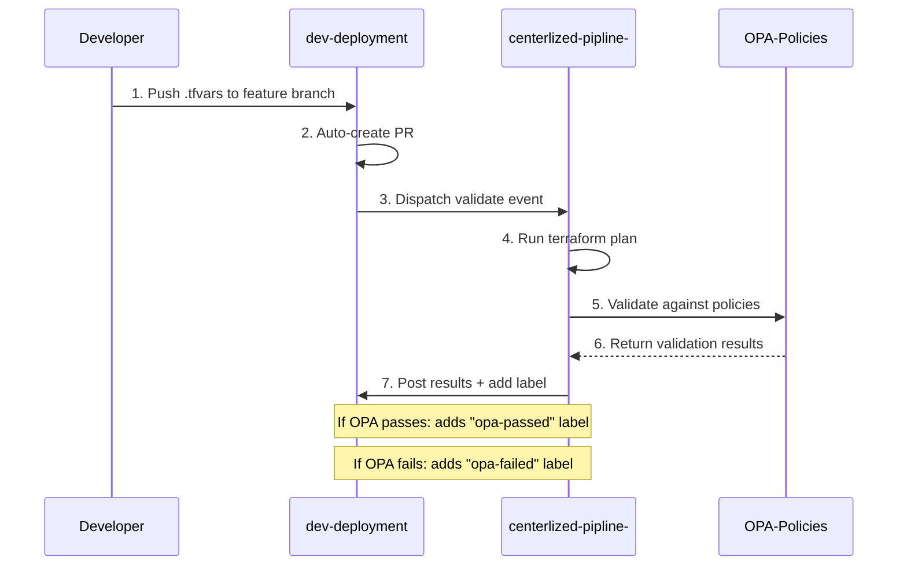
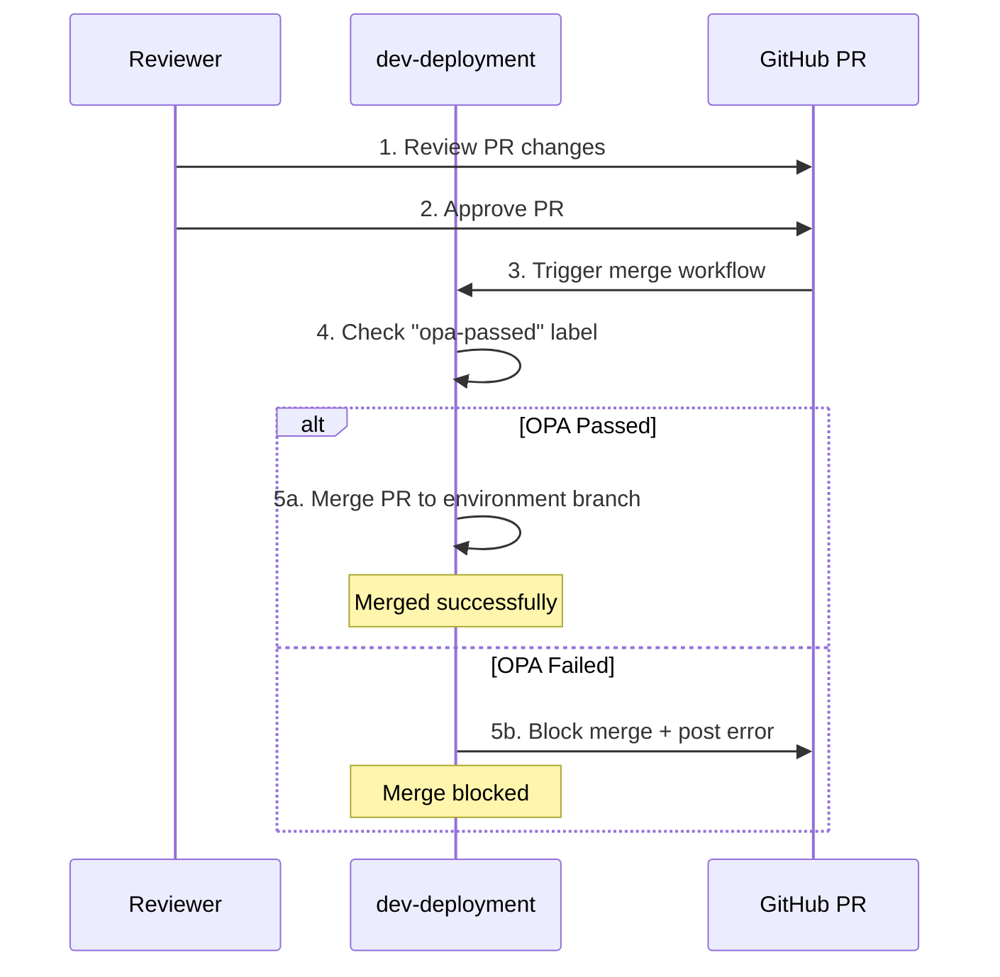
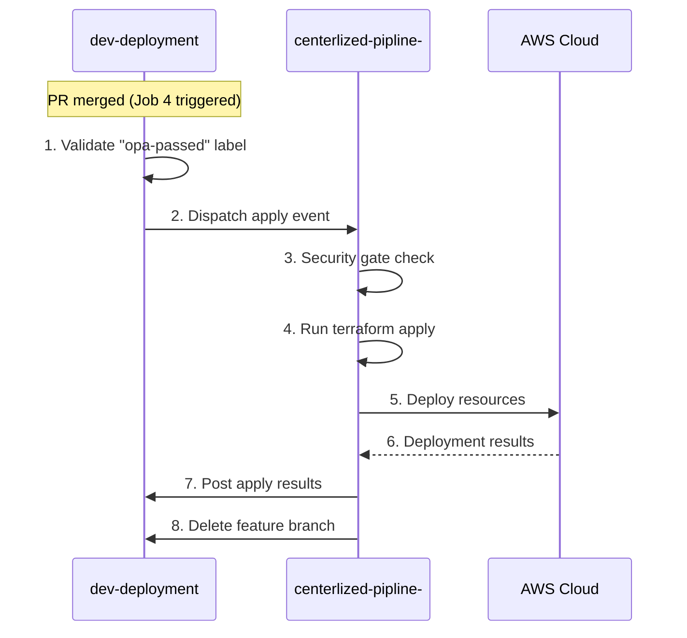

# 🚀 Centralized Terraform Controller - Version 2.0

**Enterprise-Grade Infrastructure Automation Platform**

---

## 📋 Table of Contents

- [System Overview](#-system-overview)
- [Architecture](#-architecture)
- [Complete Workflow](#-complete-workflow)
- [Repository Structure](#-repository-structure)
- [Key Features](#-key-features)
- [Security & Compliance](#-security--compliance)
- [Quick Start](#-quick-start)

---

## 🎯 System Overview

**Version 2.0** is a centralized Terraform automation system that **separates infrastructure configuration from execution**. Developers work in deployment repositories, while a single centralized controller handles all validation, policy enforcement, and deployment.

### What Problem Does This Solve?

**Before Version 2.0:**
- ❌ Each team maintains their own Terraform pipelines
- ❌ Duplicate code across multiple repositories
- ❌ Inconsistent security policies
- ❌ Manual review processes
- ❌ No standardized deployment workflow

**After Version 2.0:**
- ✅ Single centralized controller manages all deployments
- ✅ Reusable Terraform modules across organization
- ✅ Automated OPA policy enforcement
- ✅ Consistent security and compliance
- ✅ Fully automated PR-to-deployment workflow

---

## 🏗️ Architecture

### 4-Repository Model

```
┌──────────────────────────────────────────────────────────────────┐
│                    ORGANIZATION INFRASTRUCTURE                    │
└──────────────────────────────────────────────────────────────────┘

┌─────────────────────┐  ┌──────────────────────┐  ┌───────────────┐
│   dev-deployment    │  │  centerlized-pipline │  │  OPA-Policies │
│                     │  │     (Controller)     │  │               │
│  • .tfvars configs  │  │  • main.tf (core)    │  │  • .rego      │
│  • Accounts/        │  │  • Workflows         │  │  • Security   │
│  • Triggers only    │──▶│  • Scripts           │◀─│  • Compliance │
│                     │  │  • Executes ALL      │  │               │
└─────────────────────┘  └──────────────────────┘  └───────────────┘
                                     │                        
                                     ▼                        
                         ┌──────────────────────┐            
                         │     tf-module        │            
                         │                      │            
                         │  • Reusable modules  │            
                         │  • IAM, S3, KMS, etc │            
                         └──────────────────────┘            
```

### Repository Responsibilities

| Repository | Purpose | Contains | Responsibility |
|------------|---------|----------|----------------|
| **dev-deployment** | Configuration Storage | `.tfvars` files, account configs | Trigger workflows, store configs |
| **centerlized-pipline-** | Execution Engine | `main.tf`, workflows, scripts | Execute validate/apply, policy checks |
| **OPA-Policies** | Security Rules | `.rego` policy files | Define security/compliance rules |
| **tf-module** | Code Library | Terraform modules | Reusable infrastructure code |

---

## 🔄 Complete Workflow

### Phase 1: Development & Validation



**Step-by-Step Breakdown:**

1. **Developer Pushes Changes**
   - Developer modifies `.tfvars` file in `dev-deployment`
   - Pushes to feature branch (e.g., `feature/add-s3-bucket`)

2. **Auto-PR Creation** (Job 1: auto-pr)
   - Workflow: `dev-deployment/.github/workflows/dispatch-to-controller.yml`
   - Automatically creates PR when `.tfvars` files change
   - Sets PR title based on account/project

3. **Dispatch Validation** (Job 2: dispatch-validate)
   - Triggers on: `pull_request` (opened, synchronize, reopened)
   - Sends `repository_dispatch` event to controller
   - Event type: `terraform_pr`
   - Payload includes: PR number, changed files, author

4. **Controller Validates**
   - Workflow: `centerlized-pipline-/.github/workflows/centralized-controller.yml`
   - Listens for: `repository_dispatch` with `terraform_pr` event
   - Steps:
     - Checkout 3 repos: controller, dev-deployment, opa-policies
     - Run pre-deployment validation
     - Execute `terraform plan`
     - Generate JSON plan for OPA

5. **OPA Policy Check**
   - Validates plan against `.rego` policies
   - Checks: naming conventions, tagging, security rules
   - Returns: violation count by severity (critical, high, medium, low)

6. **Results Posted**
   - Controller posts detailed comment to PR
   - Shows: plan summary, resource changes, OPA results
   - **Adds label:**
     - ✅ `opa-passed` + `ready-for-review` if validation succeeds
     - ❌ `opa-failed` + `needs-fixes` if validation fails

---

### Phase 2: Approval & Merge



**Step-by-Step Breakdown:**

1. **Reviewer Approves PR**
   - Reviewer checks validation results in PR comment
   - Approves PR if satisfied

2. **Merge Workflow Triggered** (Job 3: merge-pr)
   - Workflow: `dev-deployment/.github/workflows/dispatch-to-controller.yml`
   - Triggers on: `pull_request_review` with `state == 'approved'`
   - **Critical Security Gate:**
     - Checks for `opa-passed` label
     - If missing: **BLOCKS merge** and posts error comment
     - If present: Proceeds with merge

3. **PR Merged**
   - Updates PR base branch based on environment mapping:
     - `development` → `dev` branch
     - `staging` → `stage` branch
     - `production` → `prod` branch
   - Merges PR using squash merge
   - Posts success comment with merge SHA

**Key Point:** **Merge is handled by dev-deployment workflow, NOT the controller!**

---

### Phase 3: Deployment



**Step-by-Step Breakdown:**

1. **Apply Dispatch** (Job 4: dispatch-apply)
   - Workflow: `dev-deployment/.github/workflows/dispatch-to-controller.yml`
   - Triggers on: `pull_request` with `action == 'closed' && merged == true`
   - **Second Security Gate:**
     - Re-validates `opa-passed` label exists
     - If missing: Fails the workflow (safety check)
   - Sends `repository_dispatch` event to controller
   - Event type: `terraform_apply`
   - Payload includes: merge SHA, merged_by, changed files

2. **Controller Security Gate**
   - Workflow: `centerlized-pipline-/.github/workflows/centralized-controller.yml`
   - Listens for: `repository_dispatch` with `terraform_apply` event
   - **Third Security Gate (in controller):**
     - Fetches PR details from dev-deployment
     - Checks for `opa-passed` label
     - If missing: **BLOCKS apply**, closes PR, posts error
     - If present: Proceeds with apply

3. **Terraform Apply**
   - Discovers deployments from merged files
   - Runs `terraform apply` for each deployment
   - Uses Python orchestrator: `terraform-deployment-orchestrator-enhanced.py`
   - Executes in centralized controller context

4. **Results Posted**
   - Posts detailed apply results to PR
   - Shows: resources created/updated/destroyed
   - Includes: ARNs, resource names, deployment summary

5. **Cleanup**
   - Automatically deletes feature branch after successful apply
   - Keeps repository clean

---

## 📁 Repository Structure

### dev-deployment (Configuration Repository)

```
dev-deployment/
├── .github/
│   └── workflows/
│       └── dispatch-to-controller.yml  # Version 2.0 workflow
├── Accounts/
│   ├── test-4-poc-1/
│   │   ├── test-4-poc-1.tfvars         # Infrastructure config
│   │   └── test-4-poc-1.json           # Metadata
│   └── test-poc-3/
│       └── test-poc-3.tfvars
└── test-trigger-after-fixes.md

Workflow: dispatch-to-controller.yml
- Job 1: auto-pr (Auto-create PR)
- Job 2: dispatch-validate (Trigger validation)
- Job 3: merge-pr (Merge based on environment)
- Job 4: dispatch-apply (Trigger deployment)
```

### centerlized-pipline- (Controller Repository)

```
centerlized-pipline-/
├── .github/
│   └── workflows/
│       └── centralized-controller.yml  # Main controller
├── main.tf                             # Centralized Terraform
├── providers.tf
├── variables.tf
├── outputs.tf
├── scripts/
│   ├── terraform-deployment-orchestrator-enhanced.py
│   ├── opa-validator.py
│   ├── pre-deployment-validator.py
│   └── detect_existing_keys.py
├── templates/
│   └── (Terraform templates)
└── docs/

Workflow: centralized-controller.yml (1449 lines)
- Listens for: terraform_pr (validate), terraform_apply (apply)
- Uses: Terraform 1.11.0, OPA 0.59.0
- Validates: Pre-deployment, Terraform plan, OPA policies
- Executes: Terraform apply
- Manages: PR comments, labels, branch cleanup
```

### OPA-Policies (Security Repository)

```
OPA-Policies/
├── terraform/
│   ├── naming_conventions.rego
│   ├── required_tags.rego
│   ├── s3_security.rego
│   ├── iam_policies.rego
│   └── kms_encryption.rego
└── README.md

Policies enforce:
- Naming conventions
- Required tags (Environment, Owner, Team)
- S3 bucket encryption
- IAM least privilege
- KMS key rotation
```

### tf-module (Module Library)

```
tf-module/
├── Module/
│   ├── IAM/
│   │   ├── main.tf
│   │   ├── variables.tf
│   │   └── outputs.tf
│   ├── S3/
│   ├── KMS/
│   ├── Lambda/
│   └── VPC/
└── README.md

Usage in main.tf:
module "s3" {
  source = "git::https://github.com/org/tf-module.git//Module/S3"
  ...
}
```

---

## ✨ Key Features

### 1. Automated PR Lifecycle

- ✅ **Auto-PR Creation:** Detects `.tfvars` changes and creates PR automatically
- ✅ **Auto-Validation:** Runs Terraform plan + OPA check on every PR
- ✅ **Auto-Merge:** Merges to environment-specific branch when approved
- ✅ **Auto-Deploy:** Applies infrastructure after merge
- ✅ **Auto-Cleanup:** Deletes feature branch after successful apply

### 2. Three-Layer Security Gates

| Gate | Location | Purpose | Action if Failed |
|------|----------|---------|------------------|
| **Gate 1** | Controller (Validate) | OPA policy check during plan | Adds `opa-failed` label, blocks merge |
| **Gate 2** | dev-deployment (Merge) | Verify `opa-passed` label before merge | Blocks merge, posts error |
| **Gate 3** | Controller (Apply) | Re-verify `opa-passed` before apply | Blocks apply, closes PR |

### 3. Multi-Deployment Support

- Handles multiple `.tfvars` files in single PR
- Orchestrates deployments sequentially
- Reports individual success/failure for each deployment
- Continues processing even if some deployments fail

### 4. Comprehensive Reporting

**Plan Results Include:**
- ✅ Resources to add/change/destroy
- ✅ OPA validation results (violations by severity)
- ✅ Deployment metadata (account, region, owner, team)
- ✅ Commit information (author, message, SHA)
- ✅ Full Terraform plan output

**Apply Results Include:**
- ✅ Resources created/updated/destroyed count
- ✅ Resource ARNs and names
- ✅ Service types deployed
- ✅ Success/failure status per deployment
- ✅ Detailed error messages if failed

### 5. Branch Strategy

**Environment-Based Branching:**
```
feature/add-s3  →  PR  →  OPA Check  →  Merge to environment branch
                                            ↓
                            development  →  dev branch
                            staging      →  stage branch
                            production   →  prod branch
```

### 6. Performance Optimizations

- **Caching:**
  - Terraform plugins
  - Terraform modules
  - OPA policies
  - OPA binary

- **Parallel Processing:**
  - Multiple deployment plans generated in parallel
  - OPA validates all plans in single execution

---

## 🛡️ Security & Compliance

### OPA Policy Enforcement

**Severity Levels:**
- 🔴 **Critical:** Blocks deployment immediately
- 🟠 **High:** Requires fix before merge
- 🟡 **Medium:** Warning, review recommended
- 🔵 **Low:** Informational only

**Example Policies:**

1. **Naming Convention** (`naming_conventions.rego`)
   ```rego
   deny[msg] {
     resource := input.resource_changes[_]
     resource.type == "aws_s3_bucket"
     not regex.match("^[a-z0-9-]+$", resource.change.after.bucket)
     msg := sprintf("S3 bucket name must be lowercase alphanumeric with hyphens: %v", [resource.address])
   }
   ```

2. **Required Tags** (`required_tags.rego`)
   ```rego
   required_tags := ["Environment", "Owner", "Team", "Project"]
   
   deny[msg] {
     resource := input.resource_changes[_]
     missing_tags := {tag | required_tags[tag]; not resource.change.after.tags[tag]}
     count(missing_tags) > 0
     msg := sprintf("Missing required tags: %v", [missing_tags])
   }
   ```

3. **S3 Encryption** (`s3_security.rego`)
   ```rego
   deny[msg] {
     resource := input.resource_changes[_]
     resource.type == "aws_s3_bucket"
     not resource.change.after.server_side_encryption_configuration
     msg := sprintf("S3 bucket must have encryption enabled: %v", [resource.address])
   }
   ```

### AWS Credentials

**Uses OIDC Authentication:**
```yaml
- name: Configure AWS Credentials
  uses: aws-actions/configure-aws-credentials@v4
  with:
    role-to-assume: ${{ secrets.AWS_TERRAFORM_ROLE_ARN }}
    aws-region: us-east-1
    role-session-name: terraform-controller
```

**Benefits:**
- ✅ No long-lived credentials
- ✅ Automatic credential rotation
- ✅ Scoped IAM permissions
- ✅ Audit trail in CloudTrail

---

## 🚀 Quick Start

### For Developers

1. **Clone dev-deployment repository:**
   ```bash
   git clone https://github.com/org/dev-deployment.git
   cd dev-deployment
   ```

2. **Create feature branch:**
   ```bash
   git checkout -b feature/add-my-infrastructure
   ```

3. **Create or modify .tfvars:**
   ```bash
   # Create account directory
   mkdir -p Accounts/my-project
   
   # Create config file
   cat > Accounts/my-project/my-project.tfvars <<EOF
   account_name = "my-project"
   environment = "development"
   owner = "john.doe@company.com"
   team = "platform-team"
   
   # S3 bucket config
   s3_buckets = [
     {
       name = "my-app-data-bucket"
       versioning = true
       encryption = "AES256"
     }
   ]
   EOF
   ```

4. **Push changes:**
   ```bash
   git add Accounts/my-project/
   git commit -m "Add S3 bucket for my-project"
   git push origin feature/add-my-infrastructure
   ```

5. **Automated workflow:**
   - ✅ PR is automatically created
   - ✅ Terraform plan runs
   - ✅ OPA validates policies
   - ✅ Results posted as PR comment

6. **Review and approve:**
   - Check PR comment for validation results
   - If `opa-passed` label is present, request review
   - Once approved, PR auto-merges

7. **Deployment:**
   - ✅ Terraform apply runs automatically
   - ✅ Results posted to PR
   - ✅ Feature branch cleaned up

---

## 📊 Workflow Events & Triggers

### dev-deployment Events

| Event | Trigger | Job | Action |
|-------|---------|-----|--------|
| `push` (non-main) | Developer pushes to feature branch | `auto-pr` | Create PR automatically |
| `pull_request` (opened/sync) | PR opened or updated | `dispatch-validate` | Trigger validation in controller |
| `pull_request_review` (approved) | PR approved by reviewer | `merge-pr` | Merge PR to environment branch |
| `pull_request` (closed+merged) | PR merged to branch | `dispatch-apply` | Trigger deployment in controller |

### Controller Events

| Event Type | Payload | Action |
|------------|---------|--------|
| `terraform_pr` | PR details, changed files, author | Run terraform plan + OPA validation |
| `terraform_apply` | Merge SHA, merged_by, files | Run terraform apply |

---

## 🔧 Technical Details

### Workflow Versions

- **dev-deployment:** Version 2.0 (documented in workflow file)
- **Controller:** Version 2.0 (documented in workflow file)

### Tools & Versions

| Tool | Version | Purpose |
|------|---------|---------|
| Terraform | 1.11.0 | Infrastructure as Code |
| OPA | 0.59.0 | Policy validation |
| Python | 3.x | Orchestration scripts |
| GitHub Actions | Latest | Workflow automation |

### Python Scripts

1. **terraform-deployment-orchestrator-enhanced.py**
   - Discovers deployments from changed files
   - Orchestrates terraform plan/apply
   - Generates JSON results
   - Extracts resource metadata

2. **opa-validator.py**
   - Validates Terraform plans against OPA policies
   - Parses violation results
   - Generates detailed reports
   - Returns severity-based exit codes

3. **pre-deployment-validator.py**
   - Validates file structure
   - Checks account configuration
   - Verifies naming conventions
   - Pre-filters invalid PRs

---

## 📈 Benefits

### For Developers
- ✅ **Simple workflow:** Just push `.tfvars` files
- ✅ **Fast feedback:** Validation results in minutes
- ✅ **No pipeline knowledge:** Workflow is fully automated
- ✅ **Clear errors:** Detailed validation messages

### For Platform Teams
- ✅ **Centralized control:** All deployments go through one controller
- ✅ **Consistent policies:** OPA enforces standards everywhere
- ✅ **Easy maintenance:** Update controller once, affects all deployments
- ✅ **Audit trail:** Complete history of who deployed what

### For Security Teams
- ✅ **Policy enforcement:** Automatic OPA validation
- ✅ **Three security gates:** Multiple checks before deployment
- ✅ **No credential exposure:** OIDC authentication
- ✅ **Compliance reporting:** Detailed violation logs

### For Management
- ✅ **Reduced complexity:** Single workflow across organization
- ✅ **Faster deployments:** Automated PR-to-production
- ✅ **Lower risk:** Policy validation prevents misconfigurations
- ✅ **Cost optimization:** Centralized caching and orchestration

---

## 📚 Additional Resources

- **Centralized Controller README:** `centerlized-pipline-/README.md`
- **OPA Policies README:** `OPA-Policies/README.md`
- **Terraform Modules:** `tf-module/README.md`
- **Deployment Examples:** `dev-deployment/Accounts/`

---

## 📝 Release Information

- **Version:** 2.0
- **Release Date:** December 2024
- **Architecture:** 4-Repository Model
- **Workflow Type:** Event-Driven, Fully Automated
- **License:** Internal Use Only

---

**🎯 Summary:** Version 2.0 provides a fully automated, secure, and centralized Terraform deployment platform. Developers push configurations, the system handles validation, policy enforcement, and deployment automatically.
