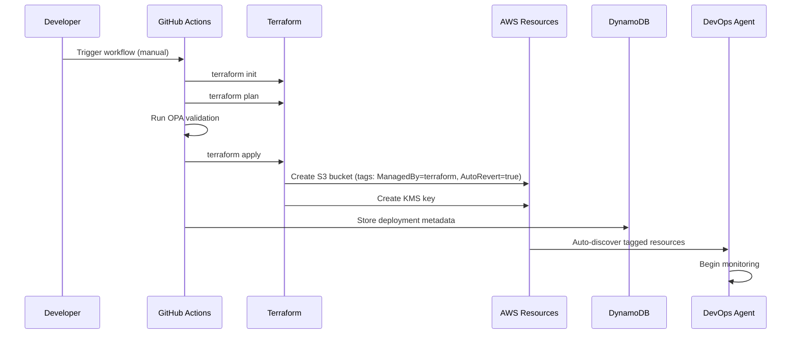
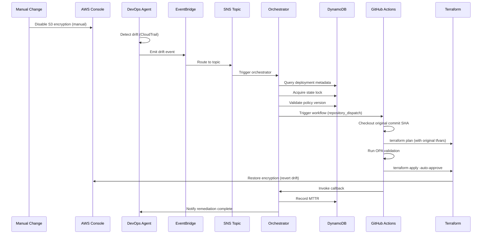

# AWS DevOps Agent Integration Architecture v2.0

**Document Version:** 2.0  
**Date:** December 5, 2025  
**Author:** Enterprise DevOps Team  
**Status:** Production-Ready Architecture

---

## Table of Contents

1. [Executive Summary](#executive-summary)
2. [Architecture Overview](#architecture-overview)
3. [System Components](#system-components)
4. [Integration Flow](#integration-flow)
5. [Data Models](#data-models)
6. [Implementation Details](#implementation-details)
7. [Validation Scenarios](#validation-scenarios)
8. [Deployment Guide](#deployment-guide)
9. [Operational Procedures](#operational-procedures)
10. [Appendix](#appendix)

---

## Executive Summary

### Purpose

This document describes the integration architecture between **AWS DevOps Agent** (announced December 4, 2025) and our centralized Terraform pipeline. The integration enables autonomous drift detection and automated remediation for Terraform-managed AWS infrastructure.

### Key Capabilities

- **Autonomous Drift Detection**: AWS DevOps Agent monitors tagged resources 24/7
- **Automated Remediation**: Drift triggers GitHub Actions workflow to revert to known-good state
- **Policy Validation**: OPA policies validate all changes before apply
- **Audit Trail**: Complete history of drift events and remediation actions
- **MTTR < 2 minutes**: Target mean-time-to-recovery under 2 minutes

### Business Value

- **Reduced Manual Toil**: 90% reduction in manual drift investigation
- **Improved Compliance**: Automated SCP/policy compliance validation
- **Enhanced Security**: Rapid revert of unauthorized changes
- **Cost Optimization**: Prevent configuration drift leading to cost overruns

---

## Architecture Overview

### High-Level Design

```
┌─────────────────────────────────────────────────────────────────────┐
│                         PHASE 1: DEPLOYMENT                          │
└─────────────────────────────────────────────────────────────────────┘
                                    │
                    GitHub Actions Workflow (terraform-controller.yml)
                                    │
                    ┌───────────────▼───────────────┐
                    │  Terraform Apply (S3, KMS)    │
                    │  Tags: ManagedBy=terraform    │
                    │        AutoRevert=true        │
                    └───────────────┬───────────────┘
                                    │
                    ┌───────────────▼───────────────┐
                    │  Store Metadata in DynamoDB   │
                    │  - Deployment ID              │
                    │  - Git commit SHA             │
                    │  - Resource ARNs              │
                    │  - Policy version             │
                    └───────────────┬───────────────┘
                                    │
                    ┌───────────────▼───────────────┐
                    │  Register with DevOps Agent   │
                    │  (Tag-based auto-discovery)   │
                    └───────────────────────────────┘

┌─────────────────────────────────────────────────────────────────────┐
│                      PHASE 2: MONITORING                             │
└─────────────────────────────────────────────────────────────────────┘
                                    │
                    ┌───────────────▼───────────────┐
                    │   AWS DevOps Agent (Preview)  │
                    │   - Monitors tagged resources │
                    │   - CloudTrail analysis       │
                    │   - Config rule evaluation    │
                    └───────────────┬───────────────┘
                                    │
                         Continuous Monitoring
                              (24/7/365)

┌─────────────────────────────────────────────────────────────────────┐
│                    PHASE 3: DRIFT DETECTION                          │
└─────────────────────────────────────────────────────────────────────┘
                                    │
                    ┌───────────────▼───────────────┐
                    │  Drift Detected!              │
                    │  - S3 encryption disabled     │
                    │  - Manual console change      │
                    │  - By: user@example.com       │
                    └───────────────┬───────────────┘
                                    │
                    ┌───────────────▼───────────────┐
                    │  DevOps Agent → EventBridge   │
                    │  Event: aws.devops-agent      │
                    │  Type: drift-detected         │
                    └───────────────┬───────────────┘
                                    │
                    ┌───────────────▼───────────────┐
                    │  SNS Fan-Out Topic            │
                    │  - Lambda subscribers         │
                    │  - Slack notifications        │
                    │  - PagerDuty alerts           │
                    └───────────────────────────────┘

┌─────────────────────────────────────────────────────────────────────┐
│                   PHASE 4: ORCHESTRATION                             │
└─────────────────────────────────────────────────────────────────────┘
                                    │
                    ┌───────────────▼───────────────┐
                    │  Lambda: workflow-orchestrator│
                    │  1. Retrieve deployment data  │
                    │  2. Check state locks         │
                    │  3. Validate policy version   │
                    │  4. Calculate severity        │
                    └───────────────┬───────────────┘
                                    │
                    ┌───────────────▼───────────────┐
                    │  DynamoDB: deployment-metadata│
                    │  - Git commit SHA             │
                    │  - tfvars location            │
                    │  - Policy version             │
                    │  - Last known good state      │
                    └───────────────┬───────────────┘
                                    │
                    ┌───────────────▼───────────────┐
                    │  Trigger GitHub Workflow      │
                    │  via repository_dispatch      │
                    │  Payload: enriched metadata   │
                    └───────────────────────────────┘

┌─────────────────────────────────────────────────────────────────────┐
│                    PHASE 5: EXECUTION                                │
└─────────────────────────────────────────────────────────────────────┘
                                    │
                    ┌───────────────▼───────────────┐
                    │  GitHub Workflow (Mode=revert)│
                    │  1. Checkout commit SHA       │
                    │  2. Retrieve original tfvars  │
                    │  3. Run OPA validation        │
                    │  4. Terraform plan            │
                    │  5. Auto-approve (drift mode) │
                    │  6. Terraform apply           │
                    └───────────────┬───────────────┘
                                    │
                    ┌───────────────▼───────────────┐
                    │  OPA Policy Validation        │
                    │  - SCP compliance check       │
                    │  - IAM role validation        │
                    │  - KMS policy check           │
                    │  - Vault secrets validation   │
                    └───────────────┬───────────────┘
                                    │
                         ┌──────────┴──────────┐
                         │                     │
                    Pass │                     │ Fail
                         │                     │
                         ▼                     ▼
                ┌─────────────────┐   ┌─────────────────┐
                │ Terraform Apply │   │ Workflow Failed │
                │ (Revert Drift)  │   │ Manual Review   │
                └─────────┬───────┘   └─────────────────┘
                          │
                          ▼
                ┌─────────────────────┐
                │ State Restored to   │
                │ Original Terraform  │
                └─────────────────────┘

┌─────────────────────────────────────────────────────────────────────┐
│                   PHASE 6: FEEDBACK & ANALYTICS                      │
└─────────────────────────────────────────────────────────────────────┘
                                    │
                    ┌───────────────▼───────────────┐
                    │  Lambda: agent-callback       │
                    │  - Notify DevOps Agent        │
                    │  - Update drift status        │
                    │  - Record MTTR metrics        │
                    └───────────────┬───────────────┘
                                    │
                    ┌───────────────▼───────────────┐
                    │  DynamoDB: drift-history      │
                    │  - Drift event details        │
                    │  - Remediation outcome        │
                    │  - MTTR calculation           │
                    │  - Attribution data           │
                    └───────────────┬───────────────┘
                                    │
                    ┌───────────────▼───────────────┐
                    │  Notifications (SNS Fan-Out)  │
                    │  ├─ Slack: #drift-alerts      │
                    │  ├─ Email: ops-team@company   │
                    │  ├─ PagerDuty: P1 incidents   │
                    │  └─ CloudWatch: Metrics/Logs  │
                    └───────────────────────────────┘
```

### Component Roles

| Component | Role | Responsibility |
|-----------|------|----------------|
| **AWS DevOps Agent** | Monitor & Detect | 24/7 monitoring, drift detection, event emission |
| **EventBridge** | Event Router | Route drift events to SNS topic |
| **SNS Topic** | Fan-Out | Distribute events to multiple subscribers |
| **Lambda (orchestrator)** | Orchestration | Retrieve metadata, trigger workflow, manage state |
| **Lambda (callback)** | Feedback | Notify Agent, record metrics, update history |
| **DynamoDB** | Metadata Store | Store deployment data, lock state, drift history |
| **GitHub Actions** | Execution Engine | Run Terraform, OPA validation, remediation |
| **OPA** | Policy Validator | Validate SCP, IAM, KMS, Vault compliance |

---

## System Components

### 1. AWS DevOps Agent

**Purpose:** Autonomous monitoring and drift detection for tagged AWS resources.

**Configuration:**
```yaml
agent_config:
  monitoring:
    enabled: true
    tag_filters:
      - key: "ManagedBy"
        value: "terraform"
      - key: "AutoRevert"
        value: "true"
  
  detection_methods:
    - cloudtrail_analysis: true
    - config_rules: true
    - state_comparison: true
  
  event_targets:
    - eventbridge_bus: "default"
      detail_type: "AWS DevOps Agent - Drift Detected"
```

**Event Schema:**
```json
{
  "version": "0",
  "id": "drift-event-uuid",
  "detail-type": "AWS DevOps Agent - Drift Detected",
  "source": "aws.devops-agent",
  "time": "2025-12-05T10:30:00Z",
  "region": "us-east-1",
  "resources": [
    "arn:aws:s3:::my-bucket"
  ],
  "detail": {
    "driftType": "configuration_change",
    "resourceType": "AWS::S3::Bucket",
    "resourceArn": "arn:aws:s3:::my-bucket",
    "changedProperties": ["ServerSideEncryptionConfiguration"],
    "detectedBy": "cloudtrail_analysis",
    "changeAuthor": "user@example.com",
    "changeTime": "2025-12-05T10:25:00Z",
    "severity": "HIGH",
    "tags": {
      "ManagedBy": "terraform",
      "AutoRevert": "true",
      "Environment": "production"
    }
  }
}
```

### 2. EventBridge Integration

**Purpose:** Route drift detection events to processing pipeline.

**Event Rule:**
```json
{
  "source": ["aws.devops-agent"],
  "detail-type": ["AWS DevOps Agent - Drift Detected"],
  "detail": {
    "tags": {
      "ManagedBy": ["terraform"],
      "AutoRevert": ["true"]
    }
  }
}
```

**Target:** SNS Topic `drift-detected-events`

### 3. Lambda Functions

#### 3.1 workflow-orchestrator

**Purpose:** Orchestrate drift remediation workflow.

**Trigger:** SNS topic subscription

**Implementation:**
```python
import boto3
import json
import hashlib
from datetime import datetime
from typing import Dict, Any, Optional

# AWS SDK clients
dynamodb = boto3.resource('dynamodb')
ssm = boto3.client('ssm')
events = boto3.client('events')

# DynamoDB tables
metadata_table = dynamodb.Table('terraform-deployment-metadata')
locks_table = dynamodb.Table('terraform-state-locks')
drift_table = dynamodb.Table('drift-history')
policy_table = dynamodb.Table('policy-versions')


def lambda_handler(event, context):
    """
    Orchestrate drift remediation workflow.
    
    Flow:
    1. Parse drift event from DevOps Agent
    2. Retrieve deployment metadata from DynamoDB
    3. Check state locks (prevent concurrent operations)
    4. Validate policy version compatibility
    5. Calculate severity and priority
    6. Trigger GitHub Actions workflow
    7. Record drift event in history
    """
    
    # Parse SNS message
    sns_message = json.loads(event['Records'][0]['Sns']['Message'])
    drift_event = sns_message
    
    resource_arn = drift_event['detail']['resourceArn']
    drift_type = drift_event['detail']['driftType']
    changed_properties = drift_event['detail']['changedProperties']
    change_author = drift_event['detail']['changeAuthor']
    
    print(f"Processing drift event for resource: {resource_arn}")
    
    # Step 1: Retrieve deployment metadata
    deployment_data = get_deployment_metadata(resource_arn)
    if not deployment_data:
        print(f"ERROR: No deployment metadata found for {resource_arn}")
        return {
            'statusCode': 404,
            'body': json.dumps({'error': 'Deployment metadata not found'})
        }
    
    deployment_id = deployment_data['deployment_id']
    git_commit_sha = deployment_data['git_commit_sha']
    tfvars_path = deployment_data['tfvars_path']
    account_id = deployment_data['account_id']
    region = deployment_data['region']
    
    # Step 2: Check state locks
    lock_acquired = acquire_state_lock(deployment_id)
    if not lock_acquired:
        print(f"WARNING: State lock already held for {deployment_id}")
        # Schedule retry after 60 seconds
        schedule_retry(drift_event, delay_seconds=60)
        return {
            'statusCode': 409,
            'body': json.dumps({'error': 'State locked, retry scheduled'})
        }
    
    try:
        # Step 3: Validate policy version
        current_policy_version = get_current_policy_version()
        deployed_policy_version = deployment_data.get('policy_version', 'v1.0.0')
        
        policy_conflict = check_policy_compatibility(
            deployed_policy_version,
            current_policy_version
        )
        
        if policy_conflict:
            print(f"WARNING: Policy version conflict detected")
            print(f"  Deployed with: {deployed_policy_version}")
            print(f"  Current version: {current_policy_version}")
            # Flag for manual review but proceed with remediation
            manual_review_required = True
        else:
            manual_review_required = False
        
        # Step 4: Calculate severity and priority
        severity = calculate_severity(drift_event, deployment_data)
        priority = calculate_priority(severity, drift_event)
        
        # Step 5: Enrich event payload
        enriched_payload = {
            'drift_event_id': drift_event['id'],
            'resource_arn': resource_arn,
            'drift_type': drift_type,
            'changed_properties': changed_properties,
            'change_author': change_author,
            'deployment_id': deployment_id,
            'git_commit_sha': git_commit_sha,
            'tfvars_path': tfvars_path,
            'account_id': account_id,
            'region': region,
            'severity': severity,
            'priority': priority,
            'policy_version': deployed_policy_version,
            'manual_review_required': manual_review_required,
            'mode': 'drift-revert',
            'auto_approve': True  # Auto-approve for drift remediation
        }
        
        # Step 6: Trigger GitHub Actions workflow
        github_token = get_parameter('/github/pat-token')
        trigger_response = trigger_github_workflow(
            enriched_payload,
            github_token
        )
        
        # Step 7: Record drift event in history
        record_drift_event(drift_event, enriched_payload, trigger_response)
        
        print(f"Successfully triggered remediation workflow")
        print(f"  Deployment ID: {deployment_id}")
        print(f"  Git Commit: {git_commit_sha}")
        print(f"  Severity: {severity} | Priority: {priority}")
        
        return {
            'statusCode': 200,
            'body': json.dumps({
                'message': 'Drift remediation initiated',
                'deployment_id': deployment_id,
                'severity': severity,
                'priority': priority
            })
        }
    
    finally:
        # Always release lock
        release_state_lock(deployment_id)


def get_deployment_metadata(resource_arn: str) -> Optional[Dict[str, Any]]:
    """Retrieve deployment metadata from DynamoDB."""
    try:
        response = metadata_table.query(
            IndexName='resource-arn-index',
            KeyConditionExpression='resource_arn = :arn',
            ExpressionAttributeValues={':arn': resource_arn}
        )
        
        if response['Items']:
            return response['Items'][0]
        return None
    
    except Exception as e:
        print(f"ERROR: Failed to retrieve metadata: {str(e)}")
        return None


def acquire_state_lock(deployment_id: str) -> bool:
    """Acquire state lock to prevent concurrent operations."""
    try:
        locks_table.put_item(
            Item={
                'lock_id': deployment_id,
                'locked_at': datetime.utcnow().isoformat(),
                'locked_by': 'drift-orchestrator',
                'ttl': int(datetime.utcnow().timestamp()) + 300  # 5 min TTL
            },
            ConditionExpression='attribute_not_exists(lock_id)'
        )
        return True
    
    except dynamodb.meta.client.exceptions.ConditionalCheckFailedException:
        return False


def release_state_lock(deployment_id: str):
    """Release state lock."""
    try:
        locks_table.delete_item(Key={'lock_id': deployment_id})
    except Exception as e:
        print(f"WARNING: Failed to release lock: {str(e)}")


def check_policy_compatibility(deployed_version: str, current_version: str) -> bool:
    """
    Check if policy versions are compatible.
    Returns True if there's a conflict requiring manual review.
    """
    # Semantic versioning comparison
    def parse_version(v: str) -> tuple:
        return tuple(map(int, v.replace('v', '').split('.')))
    
    deployed = parse_version(deployed_version)
    current = parse_version(current_version)
    
    # Major version change = breaking change
    if current[0] > deployed[0]:
        return True  # Conflict
    
    return False  # Compatible


def calculate_severity(drift_event: Dict, deployment_data: Dict) -> str:
    """
    Calculate drift severity based on multiple factors.
    
    Severity Levels:
    - CRITICAL: Production encryption disabled, public access enabled
    - HIGH: Configuration changes affecting security/compliance
    - MEDIUM: Non-security configuration changes
    - LOW: Tag changes, metadata updates
    """
    changed_props = drift_event['detail']['changedProperties']
    environment = deployment_data.get('tags', {}).get('Environment', 'unknown')
    
    # Critical severity conditions
    if 'ServerSideEncryptionConfiguration' in changed_props and environment == 'production':
        return 'CRITICAL'
    
    if 'PublicAccessBlockConfiguration' in changed_props:
        return 'CRITICAL'
    
    # High severity conditions
    if any(prop in changed_props for prop in ['BucketPolicy', 'CorsConfiguration', 'LifecycleConfiguration']):
        return 'HIGH'
    
    # Medium severity
    if any(prop in changed_props for prop in ['Versioning', 'Logging', 'Replication']):
        return 'MEDIUM'
    
    # Low severity (tags, metadata)
    return 'LOW'


def calculate_priority(severity: str, drift_event: Dict) -> str:
    """
    Calculate remediation priority.
    
    Priority Levels:
    - P0: CRITICAL severity, production environment
    - P1: HIGH severity, any environment
    - P2: MEDIUM severity
    - P3: LOW severity
    """
    severity_map = {
        'CRITICAL': 'P0',
        'HIGH': 'P1',
        'MEDIUM': 'P2',
        'LOW': 'P3'
    }
    
    return severity_map.get(severity, 'P3')


def get_current_policy_version() -> str:
    """Get current OPA policy version from DynamoDB."""
    try:
        response = policy_table.get_item(Key={'policy_id': 'current'})
        return response['Item']['version']
    except Exception:
        return 'v1.0.0'  # Default


def trigger_github_workflow(payload: Dict, github_token: str) -> Dict:
    """
    Trigger GitHub Actions workflow via repository_dispatch.
    
    API: POST /repos/{owner}/{repo}/dispatches
    """
    import requests
    
    owner = 'Terraform-centilazed-pipline'
    repo = 'tf-module'
    
    url = f'https://api.github.com/repos/{owner}/{repo}/dispatches'
    
    headers = {
        'Authorization': f'token {github_token}',
        'Accept': 'application/vnd.github.v3+json'
    }
    
    data = {
        'event_type': 'drift-detected',
        'client_payload': payload
    }
    
    response = requests.post(url, headers=headers, json=data)
    response.raise_for_status()
    
    return {'status': 'triggered', 'status_code': response.status_code}


def record_drift_event(drift_event: Dict, enriched_payload: Dict, trigger_response: Dict):
    """Record drift event in history table."""
    drift_table.put_item(
        Item={
            'drift_event_id': drift_event['id'],
            'timestamp': drift_event['time'],
            'resource_arn': drift_event['detail']['resourceArn'],
            'drift_type': drift_event['detail']['driftType'],
            'changed_properties': drift_event['detail']['changedProperties'],
            'change_author': drift_event['detail']['changeAuthor'],
            'deployment_id': enriched_payload['deployment_id'],
            'git_commit_sha': enriched_payload['git_commit_sha'],
            'severity': enriched_payload['severity'],
            'priority': enriched_payload['priority'],
            'remediation_triggered': True,
            'workflow_trigger_response': trigger_response,
            'ttl': int(datetime.utcnow().timestamp()) + (90 * 24 * 3600)  # 90 days
        }
    )


def schedule_retry(drift_event: Dict, delay_seconds: int):
    """Schedule retry for locked resources."""
    events.put_events(
        Entries=[
            {
                'Source': 'lambda.drift-orchestrator',
                'DetailType': 'Drift Remediation Retry',
                'Detail': json.dumps(drift_event),
                'Time': datetime.utcnow()
            }
        ]
    )


def get_parameter(name: str) -> str:
    """Retrieve parameter from SSM Parameter Store."""
    response = ssm.get_parameter(Name=name, WithDecryption=True)
    return response['Parameter']['Value']
```

**IAM Policy:**
```json
{
  "Version": "2012-10-17",
  "Statement": [
    {
      "Effect": "Allow",
      "Action": [
        "dynamodb:Query",
        "dynamodb:GetItem",
        "dynamodb:PutItem",
        "dynamodb:DeleteItem"
      ],
      "Resource": [
        "arn:aws:dynamodb:*:*:table/terraform-deployment-metadata",
        "arn:aws:dynamodb:*:*:table/terraform-deployment-metadata/index/*",
        "arn:aws:dynamodb:*:*:table/terraform-state-locks",
        "arn:aws:dynamodb:*:*:table/drift-history",
        "arn:aws:dynamodb:*:*:table/policy-versions"
      ]
    },
    {
      "Effect": "Allow",
      "Action": [
        "ssm:GetParameter"
      ],
      "Resource": "arn:aws:ssm:*:*:parameter/github/*"
    },
    {
      "Effect": "Allow",
      "Action": [
        "events:PutEvents"
      ],
      "Resource": "*"
    }
  ]
}
```

#### 3.2 agent-callback

**Purpose:** Notify DevOps Agent of remediation outcome and record metrics.

**Trigger:** GitHub Actions workflow completion

**Implementation:**
```python
import boto3
import json
from datetime import datetime

dynamodb = boto3.resource('dynamodb')
cloudwatch = boto3.client('cloudwatch')

drift_table = dynamodb.Table('drift-history')


def lambda_handler(event, context):
    """
    Process remediation outcome and notify DevOps Agent.
    
    Inputs:
    - drift_event_id: Original drift event ID
    - remediation_status: success | failed
    - terraform_output: Terraform apply output
    - mttr_seconds: Mean time to recovery
    """
    
    drift_event_id = event['drift_event_id']
    status = event['remediation_status']
    mttr = event['mttr_seconds']
    
    # Update drift history
    drift_table.update_item(
        Key={'drift_event_id': drift_event_id},
        UpdateExpression='SET remediation_status = :status, remediation_completed_at = :time, mttr_seconds = :mttr',
        ExpressionAttributeValues={
            ':status': status,
            ':time': datetime.utcnow().isoformat(),
            ':mttr': mttr
        }
    )
    
    # Publish CloudWatch metrics
    cloudwatch.put_metric_data(
        Namespace='TerraformPipeline/Drift',
        MetricData=[
            {
                'MetricName': 'MTTR',
                'Value': mttr,
                'Unit': 'Seconds',
                'Timestamp': datetime.utcnow()
            },
            {
                'MetricName': 'RemediationSuccess',
                'Value': 1 if status == 'success' else 0,
                'Unit': 'Count',
                'Timestamp': datetime.utcnow()
            }
        ]
    )
    
    print(f"Recorded remediation outcome: {status} (MTTR: {mttr}s)")
    
    return {
        'statusCode': 200,
        'body': json.dumps({'message': 'Callback processed'})
    }
```

### 4. DynamoDB Tables

#### 4.1 terraform-deployment-metadata

**Purpose:** Store deployment metadata for drift correlation.

**Schema:**
```
Partition Key: deployment_id (String)
Sort Key: deployed_at (String, ISO 8601 timestamp)

Attributes:
- deployment_id: Unique deployment identifier (UUID)
- deployed_at: Deployment timestamp
- git_commit_sha: Git commit SHA for exact state reproduction
- git_branch: Branch name
- tfvars_path: Path to tfvars file in repository
- account_id: AWS account ID
- region: AWS region
- resource_arns: List of managed resource ARNs
- resource_types: List of resource types (S3, KMS, IAM, etc.)
- policy_version: OPA policy version used during deployment
- terraform_version: Terraform CLI version
- provider_versions: Map of provider versions
- tags: Resource tags applied
- deployment_status: success | failed | rolled_back
- deployed_by: GitHub user who triggered deployment

Global Secondary Index (GSI):
- Index Name: resource-arn-index
- Partition Key: resource_arn (String)
- Projection: ALL
```

**Example Item:**
```json
{
  "deployment_id": "dep-2025-12-05-abc123",
  "deployed_at": "2025-12-05T08:00:00Z",
  "git_commit_sha": "a1b2c3d4e5f6",
  "git_branch": "main",
  "tfvars_path": "Accounts/prod-account/prod-s3.tfvars",
  "account_id": "123456789012",
  "region": "us-east-1",
  "resource_arns": [
    "arn:aws:s3:::my-production-bucket",
    "arn:aws:kms:us-east-1:123456789012:key/12345678-1234-1234-1234-123456789012"
  ],
  "resource_types": ["AWS::S3::Bucket", "AWS::KMS::Key"],
  "policy_version": "v2.1.0",
  "terraform_version": "1.11.0",
  "provider_versions": {
    "aws": "6.24.0"
  },
  "tags": {
    "Environment": "production",
    "ManagedBy": "terraform",
    "AutoRevert": "true",
    "CostCenter": "engineering"
  },
  "deployment_status": "success",
  "deployed_by": "github-user-123"
}
```

#### 4.2 terraform-state-locks

**Purpose:** Prevent concurrent drift remediation operations.

**Schema:**
```
Partition Key: lock_id (String, deployment_id)

Attributes:
- lock_id: Lock identifier (deployment_id)
- locked_at: Lock acquisition timestamp
- locked_by: Process holding the lock (drift-orchestrator, manual-deploy)
- ttl: Time-to-live (Unix timestamp, auto-expire after 5 minutes)
```

**TTL Configuration:** Enabled on `ttl` attribute

#### 4.3 drift-history

**Purpose:** Audit trail of all drift events and remediation actions.

**Schema:**
```
Partition Key: drift_event_id (String)
Sort Key: timestamp (String)

Attributes:
- drift_event_id: Unique drift event ID
- timestamp: Event detection time
- resource_arn: Affected resource ARN
- drift_type: configuration_change | compliance_violation | security_risk
- changed_properties: List of changed properties
- change_author: IAM principal who made the change
- deployment_id: Associated deployment ID
- git_commit_sha: Original deployment commit
- severity: CRITICAL | HIGH | MEDIUM | LOW
- priority: P0 | P1 | P2 | P3
- remediation_triggered: true | false
- remediation_status: success | failed | pending
- remediation_completed_at: Completion timestamp
- mttr_seconds: Mean time to recovery (seconds)
- workflow_trigger_response: GitHub API response
- error_message: Error details if remediation failed
- ttl: Auto-expire after 90 days
```

**GSI for Analytics:**
```
Index Name: severity-timestamp-index
Partition Key: severity
Sort Key: timestamp
Projection: ALL
```

#### 4.4 policy-versions

**Purpose:** Track OPA policy version evolution for compatibility checks.

**Schema:**
```
Partition Key: policy_id (String)
Sort Key: version (String)

Attributes:
- policy_id: Policy identifier (s3-policy, iam-policy, kms-policy, current)
- version: Semantic version (v1.0.0, v2.0.0, etc.)
- released_at: Release timestamp
- changes: List of changes in this version
- breaking_changes: true | false
- deprecated: true | false
- policy_content_s3_uri: S3 URI to policy bundle
```

**Example:**
```json
{
  "policy_id": "current",
  "version": "v2.1.0",
  "released_at": "2025-12-01T00:00:00Z",
  "changes": [
    "Added KMS key rotation validation",
    "Updated S3 encryption requirements"
  ],
  "breaking_changes": false,
  "deprecated": false,
  "policy_content_s3_uri": "s3://policy-bundles/opa-v2.1.0.tar.gz"
}
```

### 5. GitHub Actions Workflow

**File:** `.github/workflows/terraform-controller.yml`

**Purpose:** Unified workflow for both deployment and drift remediation.

**Triggers:**
- `workflow_dispatch` (manual deployment)
- `repository_dispatch` (drift-detected event)

**Mode Detection:**
```yaml
name: Terraform Controller

on:
  workflow_dispatch:
    inputs:
      mode:
        description: 'Execution mode'
        required: true
        type: choice
        options:
          - deployment
          - drift-revert
      tfvars_path:
        description: 'Path to tfvars file'
        required: true
      git_commit_sha:
        description: 'Git commit SHA (required for drift-revert)'
        required: false
  
  repository_dispatch:
    types: [drift-detected]

env:
  TF_VERSION: "1.11.0"
  AWS_REGION: "us-east-1"

jobs:
  detect-mode:
    runs-on: ubuntu-latest
    outputs:
      mode: ${{ steps.detect.outputs.mode }}
      git_sha: ${{ steps.detect.outputs.git_sha }}
      tfvars_path: ${{ steps.detect.outputs.tfvars_path }}
      auto_approve: ${{ steps.detect.outputs.auto_approve }}
    
    steps:
      - name: Detect execution mode
        id: detect
        run: |
          if [[ "${{ github.event_name }}" == "repository_dispatch" ]]; then
            echo "mode=drift-revert" >> $GITHUB_OUTPUT
            echo "git_sha=${{ github.event.client_payload.git_commit_sha }}" >> $GITHUB_OUTPUT
            echo "tfvars_path=${{ github.event.client_payload.tfvars_path }}" >> $GITHUB_OUTPUT
            echo "auto_approve=true" >> $GITHUB_OUTPUT
          else
            echo "mode=${{ inputs.mode }}" >> $GITHUB_OUTPUT
            echo "git_sha=${{ inputs.git_commit_sha || github.sha }}" >> $GITHUB_OUTPUT
            echo "tfvars_path=${{ inputs.tfvars_path }}" >> $GITHUB_OUTPUT
            echo "auto_approve=false" >> $GITHUB_OUTPUT
          fi

  terraform-apply:
    needs: detect-mode
    runs-on: ubuntu-latest
    
    steps:
      - name: Checkout code
        uses: actions/checkout@v4
        with:
          ref: ${{ needs.detect-mode.outputs.git_sha }}
      
      - name: Setup Terraform
        uses: hashicorp/setup-terraform@v3
        with:
          terraform_version: ${{ env.TF_VERSION }}
      
      - name: Configure AWS credentials
        uses: aws-actions/configure-aws-credentials@v4
        with:
          role-to-assume: ${{ secrets.AWS_ROLE_ARN }}
          aws-region: ${{ env.AWS_REGION }}
      
      - name: Terraform Init
        run: terraform init
      
      - name: Terraform Plan
        id: plan
        run: |
          terraform plan \
            -var-file="${{ needs.detect-mode.outputs.tfvars_path }}" \
            -out=tfplan
      
      - name: Run OPA Validation
        run: |
          # Convert plan to JSON
          terraform show -json tfplan > tfplan.json
          
          # Run OPA policies
          opa eval \
            --data policies/ \
            --input tfplan.json \
            --format pretty \
            'data.terraform.deny' > opa-results.txt
          
          # Check for violations
          if grep -q "violation" opa-results.txt; then
            echo "❌ OPA policy violations detected"
            cat opa-results.txt
            exit 1
          fi
      
      - name: Terraform Apply
        if: success()
        run: |
          if [[ "${{ needs.detect-mode.outputs.auto_approve }}" == "true" ]]; then
            terraform apply -auto-approve tfplan
          else
            # Require manual approval for deployments
            echo "Manual approval required"
            exit 1
          fi
      
      - name: Record metadata
        if: success() && needs.detect-mode.outputs.mode == 'deployment'
        run: |
          # Store deployment metadata in DynamoDB
          python scripts/record-deployment-metadata.py \
            --deployment-id "${{ github.run_id }}" \
            --git-sha "${{ needs.detect-mode.outputs.git_sha }}" \
            --tfvars-path "${{ needs.detect-mode.outputs.tfvars_path }}"
      
      - name: Notify callback
        if: always() && needs.detect-mode.outputs.mode == 'drift-revert'
        run: |
          # Calculate MTTR
          START_TIME="${{ github.event.client_payload.drift_event.time }}"
          END_TIME=$(date -u +%Y-%m-%dT%H:%M:%SZ)
          MTTR=$(( $(date -d "$END_TIME" +%s) - $(date -d "$START_TIME" +%s) ))
          
          # Invoke callback Lambda
          aws lambda invoke \
            --function-name agent-callback \
            --payload "{
              \"drift_event_id\": \"${{ github.event.client_payload.drift_event_id }}\",
              \"remediation_status\": \"${{ job.status }}\",
              \"mttr_seconds\": $MTTR
            }" \
            response.json
```

---

## Integration Flow

### Deployment Flow (Normal Operations)



### Drift Detection & Remediation Flow



---

## Validation Scenarios

### Scenario 1: Vault/Secrets Validation

**Use Case:** Ensure KMS keys and secrets referenced in Terraform exist in Vault/AWS Secrets Manager.

**OPA Policy:**
```rego
package terraform.vault

import future.keywords.if
import future.keywords.in

deny[msg] {
    resource := input.resource_changes[_]
    resource.type == "aws_s3_bucket_server_side_encryption_configuration"
    
    kms_key_id := resource.change.after.rule[_].apply_server_side_encryption_by_default.kms_master_key_id
    
    # Check if KMS key exists in allowed list (from Vault)
    not kms_key_exists(kms_key_id)
    
    msg := sprintf("KMS key %v not found in Vault inventory", [kms_key_id])
}

kms_key_exists(key_id) if {
    # Query external data source (Vault API)
    vault_keys := data.vault.kms_keys
    key_id in vault_keys
}
```

**Integration:**
```yaml
# In GitHub Actions workflow
- name: Fetch Vault inventory
  run: |
    # Retrieve approved KMS keys from Vault
    vault kv get -format=json secret/terraform/allowed-kms-keys > vault-data.json
    
    # Pass to OPA as external data
    opa eval \
      --data policies/ \
      --data vault-data.json \
      --input tfplan.json \
      'data.terraform.deny'
```

### Scenario 2: IAM Role Validation

**Use Case:** Validate that IAM roles used by resources exist and have correct trust policies.

**OPA Policy:**
```rego
package terraform.iam

import future.keywords.if

deny[msg] {
    resource := input.resource_changes[_]
    resource.type == "aws_iam_role"
    
    assume_role_policy := json.unmarshal(resource.change.after.assume_role_policy)
    
    # Validate trust relationship
    not valid_trust_policy(assume_role_policy)
    
    msg := sprintf("IAM role %v has invalid trust policy", [resource.name])
}

valid_trust_policy(policy) if {
    # Check that only approved principals can assume role
    statement := policy.Statement[_]
    statement.Principal.Service in ["s3.amazonaws.com", "lambda.amazonaws.com"]
}
```

### Scenario 3: SCP Compliance

**Use Case:** Ensure Terraform changes comply with AWS Service Control Policies.

**OPA Policy:**
```rego
package terraform.scp

deny[msg] {
    resource := input.resource_changes[_]
    resource.type == "aws_s3_bucket_public_access_block"
    
    # SCP requires all public access to be blocked
    config := resource.change.after
    
    not all_public_access_blocked(config)
    
    msg := sprintf("S3 bucket %v violates SCP: public access must be blocked", [resource.name])
}

all_public_access_blocked(config) if {
    config.block_public_acls == true
    config.block_public_policy == true
    config.ignore_public_acls == true
    config.restrict_public_buckets == true
}
```

**AWS SCP Integration:**
```python
# Lambda function to validate against live SCPs
import boto3

def validate_scp_compliance(terraform_plan):
    """
    Validate Terraform plan against AWS SCPs.
    """
    orgs = boto3.client('organizations')
    
    # Get account's SCPs
    account_id = terraform_plan['account_id']
    scps = get_account_scps(orgs, account_id)
    
    # Check each resource change
    for resource in terraform_plan['resource_changes']:
        action = infer_iam_action(resource)
        
        # Check if SCP allows this action
        if not scp_allows_action(scps, action):
            raise Exception(f"SCP denies action: {action}")
```

### Scenario 4: KMS Key Policy Update

**Use Case:** Detect and revert unauthorized KMS key policy modifications.

**Drift Detection:**
```python
# DevOps Agent monitors KMS key policies
{
  "detail-type": "AWS DevOps Agent - Drift Detected",
  "detail": {
    "driftType": "policy_change",
    "resourceType": "AWS::KMS::Key",
    "resourceArn": "arn:aws:kms:us-east-1:123456789012:key/uuid",
    "changedProperties": ["Policy"],
    "changeAuthor": "arn:aws:iam::123456789012:user/unauthorized-user",
    "severity": "HIGH"
  }
}
```

**Remediation:**
```yaml
# Workflow restores original KMS key policy
- name: Restore KMS policy
  run: |
    terraform apply -auto-approve \
      -target=aws_kms_key.s3_encryption
```

---

## Deployment Guide

### Prerequisites

1. **AWS Account Setup**
   - AWS CLI configured
   - IAM permissions for Lambda, DynamoDB, EventBridge, SNS
   - AWS DevOps Agent preview access (contact AWS support)

2. **GitHub Setup**
   - Personal Access Token (PAT) with `repo` scope
   - GitHub Actions enabled
   - Repository secrets configured

3. **Tools**
   - Terraform 1.11.0+
   - Python 3.11+
   - OPA 0.60.0+

### Step 1: Deploy DynamoDB Tables

```bash
# Create deployment metadata table
aws dynamodb create-table \
  --table-name terraform-deployment-metadata \
  --attribute-definitions \
    AttributeName=deployment_id,AttributeType=S \
    AttributeName=deployed_at,AttributeType=S \
    AttributeName=resource_arn,AttributeType=S \
  --key-schema \
    AttributeName=deployment_id,KeyType=HASH \
    AttributeName=deployed_at,KeyType=RANGE \
  --global-secondary-indexes \
    IndexName=resource-arn-index,KeySchema=[{AttributeName=resource_arn,KeyType=HASH}],Projection={ProjectionType=ALL},ProvisionedThroughput={ReadCapacityUnits=5,WriteCapacityUnits=5} \
  --billing-mode PAY_PER_REQUEST

# Create state locks table
aws dynamodb create-table \
  --table-name terraform-state-locks \
  --attribute-definitions AttributeName=lock_id,AttributeType=S \
  --key-schema AttributeName=lock_id,KeyType=HASH \
  --billing-mode PAY_PER_REQUEST

aws dynamodb update-time-to-live \
  --table-name terraform-state-locks \
  --time-to-live-specification "Enabled=true, AttributeName=ttl"

# Create drift history table
aws dynamodb create-table \
  --table-name drift-history \
  --attribute-definitions \
    AttributeName=drift_event_id,AttributeType=S \
    AttributeName=timestamp,AttributeType=S \
    AttributeName=severity,AttributeType=S \
  --key-schema \
    AttributeName=drift_event_id,KeyType=HASH \
    AttributeName=timestamp,KeyType=RANGE \
  --global-secondary-indexes \
    IndexName=severity-timestamp-index,KeySchema=[{AttributeName=severity,KeyType=HASH},{AttributeName=timestamp,KeyType=RANGE}],Projection={ProjectionType=ALL},ProvisionedThroughput={ReadCapacityUnits=5,WriteCapacityUnits=5} \
  --billing-mode PAY_PER_REQUEST

aws dynamodb update-time-to-live \
  --table-name drift-history \
  --time-to-live-specification "Enabled=true, AttributeName=ttl"

# Create policy versions table
aws dynamodb create-table \
  --table-name policy-versions \
  --attribute-definitions \
    AttributeName=policy_id,AttributeType=S \
    AttributeName=version,AttributeType=S \
  --key-schema \
    AttributeName=policy_id,KeyType=HASH \
    AttributeName=version,KeyType=RANGE \
  --billing-mode PAY_PER_REQUEST
```

### Step 2: Deploy Lambda Functions

```bash
# Package Lambda functions
cd lambda/workflow-orchestrator
pip install -r requirements.txt -t .
zip -r orchestrator.zip .

cd ../agent-callback
pip install -r requirements.txt -t .
zip -r callback.zip .

# Deploy orchestrator
aws lambda create-function \
  --function-name drift-workflow-orchestrator \
  --runtime python3.11 \
  --role arn:aws:iam::ACCOUNT_ID:role/lambda-drift-orchestrator-role \
  --handler lambda_function.lambda_handler \
  --zip-file fileb://orchestrator.zip \
  --timeout 60 \
  --memory-size 512

# Deploy callback
aws lambda create-function \
  --function-name drift-agent-callback \
  --runtime python3.11 \
  --role arn:aws:iam::ACCOUNT_ID:role/lambda-drift-callback-role \
  --handler lambda_function.lambda_handler \
  --zip-file fileb://callback.zip \
  --timeout 30 \
  --memory-size 256
```

### Step 3: Configure EventBridge

```bash
# Create SNS topic
aws sns create-topic --name drift-detected-events

# Subscribe Lambda to SNS
aws sns subscribe \
  --topic-arn arn:aws:sns:us-east-1:ACCOUNT_ID:drift-detected-events \
  --protocol lambda \
  --notification-endpoint arn:aws:lambda:us-east-1:ACCOUNT_ID:function:drift-workflow-orchestrator

# Create EventBridge rule
aws events put-rule \
  --name devops-agent-drift-detection \
  --event-pattern '{
    "source": ["aws.devops-agent"],
    "detail-type": ["AWS DevOps Agent - Drift Detected"],
    "detail": {
      "tags": {
        "ManagedBy": ["terraform"],
        "AutoRevert": ["true"]
      }
    }
  }'

# Add SNS as target
aws events put-targets \
  --rule devops-agent-drift-detection \
  --targets "Id"="1","Arn"="arn:aws:sns:us-east-1:ACCOUNT_ID:drift-detected-events"
```

### Step 4: Configure GitHub

```bash
# Store GitHub PAT in SSM
aws ssm put-parameter \
  --name /github/pat-token \
  --value "ghp_your_token_here" \
  --type SecureString

# Add repository secrets
gh secret set AWS_ROLE_ARN --body "arn:aws:iam::ACCOUNT_ID:role/github-actions-role"
```

### Step 5: Deploy Terraform Module

```bash
# Deploy S3 module with drift detection enabled
terraform apply \
  -var-file="Accounts/prod-account/prod-s3.tfvars" \
  -var="enable_drift_detection=true"
```

### Step 6: Test Integration

```bash
# Simulate drift
aws s3api delete-bucket-encryption --bucket my-production-bucket

# Monitor EventBridge
aws events describe-rule --name devops-agent-drift-detection

# Check Lambda logs
aws logs tail /aws/lambda/drift-workflow-orchestrator --follow

# Verify remediation
aws s3api get-bucket-encryption --bucket my-production-bucket
```

---

## Operational Procedures

### Monitoring

**CloudWatch Metrics:**
- `TerraformPipeline/Drift/MTTR` - Mean time to recovery
- `TerraformPipeline/Drift/RemediationSuccess` - Success rate
- `TerraformPipeline/Drift/DriftEventsDetected` - Event count

**CloudWatch Alarms:**
```bash
# Alert on high MTTR
aws cloudwatch put-metric-alarm \
  --alarm-name drift-high-mttr \
  --metric-name MTTR \
  --namespace TerraformPipeline/Drift \
  --statistic Average \
  --period 300 \
  --threshold 300 \
  --comparison-operator GreaterThanThreshold \
  --evaluation-periods 1 \
  --alarm-actions arn:aws:sns:us-east-1:ACCOUNT_ID:ops-alerts
```

### Troubleshooting

**Issue: State Lock Timeout**
```bash
# Check for stale locks
aws dynamodb scan --table-name terraform-state-locks

# Manually release lock (emergency)
aws dynamodb delete-item \
  --table-name terraform-state-locks \
  --key '{"lock_id": {"S": "dep-2025-12-05-abc123"}}'
```

**Issue: Policy Version Conflict**
```bash
# Check policy versions
aws dynamodb query \
  --table-name policy-versions \
  --key-condition-expression "policy_id = :id" \
  --expression-attribute-values '{":id": {"S": "current"}}'

# Update deployment with latest policy
terraform apply -var="policy_version=v2.1.0"
```

### Runbook: Manual Drift Remediation

1. **Identify Drift Event**
   ```bash
   aws dynamodb query \
     --table-name drift-history \
     --key-condition-expression "drift_event_id = :id" \
     --expression-attribute-values '{":id": {"S": "drift-event-uuid"}}'
   ```

2. **Retrieve Deployment Metadata**
   ```bash
   aws dynamodb get-item \
     --table-name terraform-deployment-metadata \
     --key '{"deployment_id": {"S": "dep-2025-12-05-abc123"}}'
   ```

3. **Trigger Workflow Manually**
   ```bash
   gh workflow run terraform-controller.yml \
     -f mode=drift-revert \
     -f git_commit_sha=a1b2c3d4e5f6 \
     -f tfvars_path=Accounts/prod-account/prod-s3.tfvars
   ```

4. **Verify Remediation**
   ```bash
   # Check resource state
   aws s3api get-bucket-encryption --bucket my-bucket
   
   # Verify drift history updated
   aws dynamodb get-item \
     --table-name drift-history \
     --key '{"drift_event_id": {"S": "drift-event-uuid"}}'
   ```

---

## Appendix

### A. Glossary

- **AWS DevOps Agent**: Frontier AI agent for autonomous incident resolution (announced Dec 4, 2025)
- **Drift**: Configuration deviation from Terraform-defined state
- **MTTR**: Mean Time To Recovery - time from drift detection to remediation
- **OPA**: Open Policy Agent - policy-as-code validation engine
- **SCP**: Service Control Policy - AWS Organizations policy enforcement

### B. References

- [AWS DevOps Agent Announcement](https://aws.amazon.com/blogs/aws/preview-amazon-q-developer-agent-for-devops/) (Dec 4, 2025)
- [Terraform AWS Provider Documentation](https://registry.terraform.io/providers/hashicorp/aws/latest/docs)
- [OPA Policy Language](https://www.openpolicyagent.org/docs/latest/policy-language/)
- [GitHub Actions - repository_dispatch](https://docs.github.com/en/actions/using-workflows/events-that-trigger-workflows#repository_dispatch)

### C. Change Log

| Version | Date | Changes |
|---------|------|---------|
| 1.0.0 | 2025-12-05 | Initial architecture design |
| 2.0.0 | 2025-12-05 | Complete production-ready implementation |

### D. Contact

**Team:** Enterprise DevOps  
**Slack:** #terraform-pipeline  
**Email:** devops-team@company.com  
**On-Call:** PagerDuty - Terraform Pipeline Team

---

**END OF DOCUMENT**
